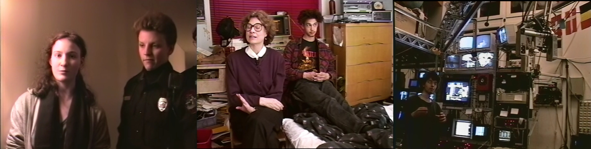

# Homework

### WEEK 01: [SEPT, 3]

Dont' forget to download + install everything listed in the [Supplies + Matrials](supplies.md) page, as well as [VirtualBox](https://www.virtualbox.org/) which we'll be using for a few demos next week. (u'll also want to download the [Kali Linux](https://www.kali.org/downloads/) which we'll be running in Virtual Box).

> Hacking is about "using new technologies in a way which is not intended." -- unnamed German hacker.

Watch [Aunauthorized Access](https://archive.org/details/UnauthorizedAccess)

This doc is a gem! made in 1994 by Annaliza Savage, she traveled to 15 cities in four countries to record the stories of notorious hackers (&& hacker culture) in that era. Not the DIY home-brew tinkier sort of hacker (like the kind discussed in Revolution OS) but the "black hoodie" breaking into systems sort of hacker. Though illegal, this was a time before the "[Cyberwar](https://www.viceland.com/en_us/show/cyberwar)" era we're in now, most of these hackers weren't paid, they weren't after money, they did what they did either for political/activist reasons, or for the challenge, or sometimes just for fun.

Next week we'll be using the Terminal, which is a "command line interface" (CLI), complete the [codecademy command line course](https://www.codecademy.com/learn/learn-the-command-line) to get acquainted with it by next week.

*over the next couple of weeks...*

u don't need to be an HTML/CSS expert to take this class, u you should have some prior experience w/it, specifically u should be familiar w/the following:

- what HTML "document" is, what an "element" is, what a "tag" is, what an "attribute" is.
- how to create an HTML file in a code editor && view it in a browser
- how to setup a basic HTML page/template using `<!DOCTYPE>, <html>, <head>, <meta>, <title>, <body>`
- how to create a simple page using elements like `<h1>, 
, , <a>`

- what CSS is && the different ways to apply it to an HTML documnet (inline, `<style>` && external style-sheet)
- what CSS properties are, as well as some of the most common ones
- how to change the default layout of a page using CSS (ie. the placement of elements)

if u need a refresher, here are a few links to learning resources:

- [Codecademy - interactive website](https://www.codecademy.com/catalog/language/html-css)
- [Don't Fear The Internet - Video Series](http://dontfeartheinternet.com/)
- [Mozilla Developer Network (MDN) - website](https://developer.mozilla.org/en-US/)
  - [HTML references && tutorials](https://developer.mozilla.org/en-US/docs/Web/HTML),
  - [CSS references && tutorials](https://developer.mozilla.org/en-US/docs/Web/CSS)
- [HTML and CSS - Book](http://www.htmlandcssbook.com/)

### WEEK 02: [SEPT, 10]

Watch [Revolution OS](https://archive.org/details/RevolutionOS)

Though  admittedly  not as exciting as some of the other docs in our [list](links.md) (in terms of it's style) this 2001 doc does a pretty solid job of explaining the history + philosophies of the Open Source + Free Software movement[s]. It includes plenty of interviews w/influential figures of the movement[s] like Linus Torvalds && Richard Stallman. (it's also [available on YouTube](https://www.youtube.com/watch?v=4vW62KqKJ5A) if u have trouble streaming on archive.org)

Keep practicing using ur terminal! notes for all Mac OS commands we've used in class are [available here](notes/command-line/README.md)

Continuing working on HTML/CSS tutorials (linked above) if u feel u need to catch up on that front, if u're not sure refer to my notes on [markup](notes/markup/README.md), [HTML](notes/html/README.md) && [CSS](notes/css/README.md) for an overview of what u should already know.

### WEEK 03: [SEPT, 17]

watch [Hyperland](https://archive.org/details/DouglasAdams-Hyperland), this BBC doc form 1990 is written by && stars Douglas Adams (author of A Hitchhikers Guide to the Galaxy), it's a history of "hypermedia" released just before the World Wide Web took off, ie. just before anyone had any real experience w/hypermedia (that serendipitous timing makes this a unique historical artifact). The the film itself is a single-channel linear video, it tries to present the viewer w/what a hypermedia experience is like through the film's aesthetic (which is also a very tasty 90's aesthetic). quite the gem.

Create a website using HTML/CSS (it can be a simple or complex as u want) but it must be "versioned" on ur GitHub (u should have more than 1 commit), name ur repo "week3".

### WEEK 04: [SEPT, 24]

for homework this week i want u to spend as much time as u can practicing ur CSS. create a repo called **CSS-ercise** && work on one or all of the following exercises:

- come up w/a few CSS ideas (as many as u have time for) && try to execute them. these could be for a portfolio page, or a blog/publication style layout or it could be more of a sketch like the examples in [CSS Art Gallery](notes/css-gallery/README.md)

- try to recreate the CSS of a web page (or part of a page) u come across in ur Internet ventures. try to get as far as u can w/out using the Inspector tool && then compare ur work to the actual code w/the Inspector after.

- create a CSS still life. setup a classic still life (fruits, flowers, etc) && see if u can recreate it in "pure CSS"

### WEEK 05: [Oc, 1]

for homework this week u'll be forking this [p5-template](https://github.com/net-art-and-cultures/p5-template) repository i made && using it as u watch + code along w/the following "[Coding Rainbow](https://thecodingtrain.com/Tutorials/)" lessons:
- Tutorial #1: P5.JS Basics (starting from "Basics of Drawing")
- Tutorial #2: Variables
- Tutorial #3: Conditionals
- Tutorial #4: Loops
- Tutorial #5: Functions

after watching/experimenting w/the lessons i want u to create ur own sketch (anything u want) using p5.js && submit it back to the original repo as a "pull-request", following the instructions in the README of the [repo](https://github.com/net-art-and-cultures/p5-template)
