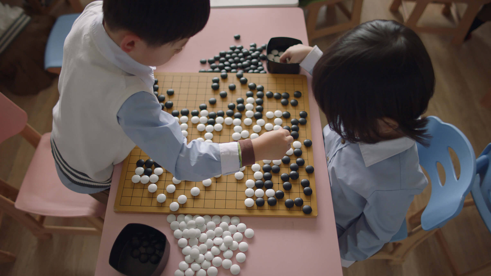
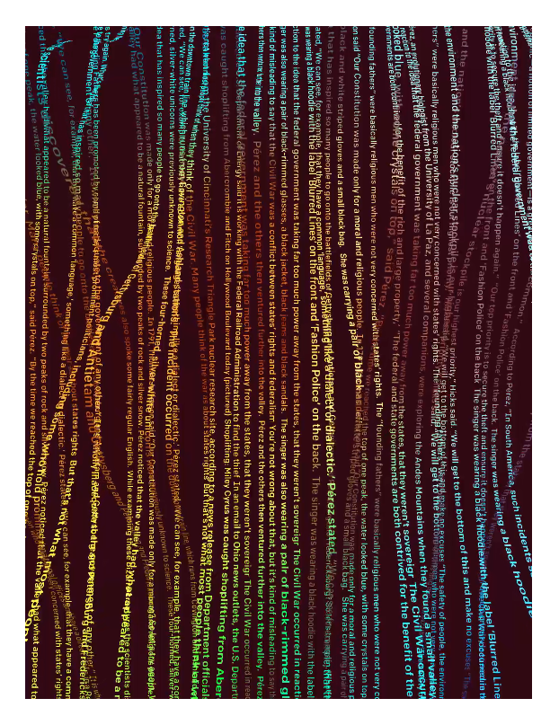
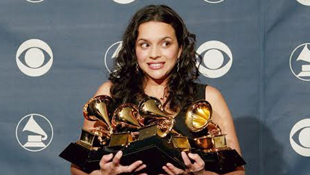
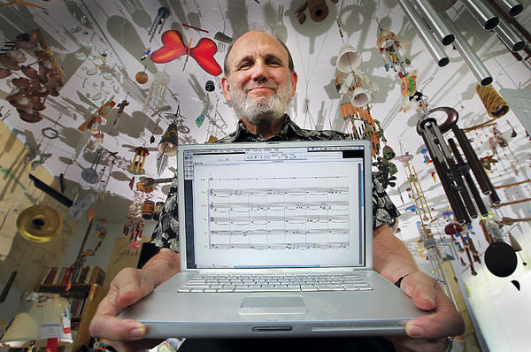
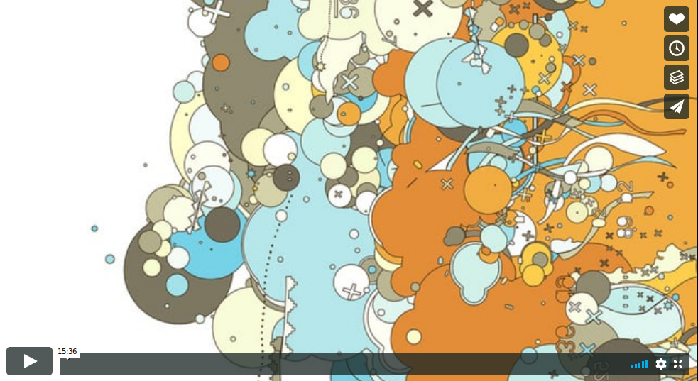
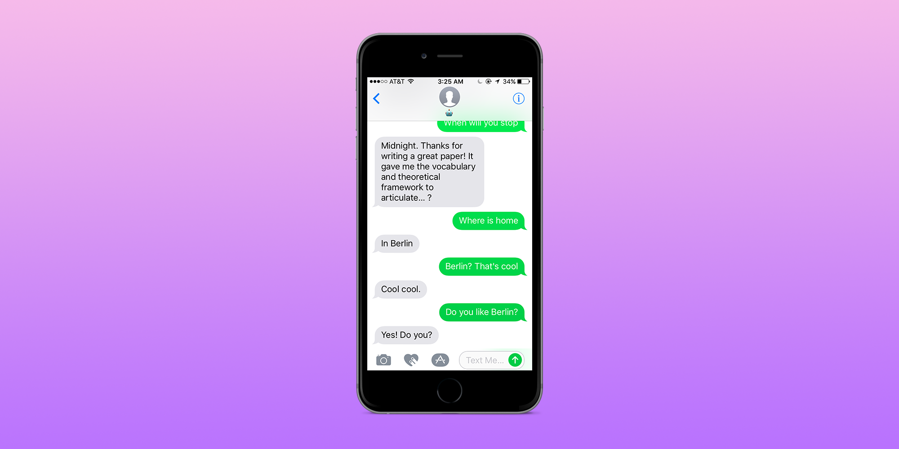

# Algorithmic Creativity

> Are computers creative? “Oh, there’s no question about it. Yes, yes, a million times yes. Creativity is simple; consciousness, intelligence, those are hard.” —David Cope

[https://www.thispersondoesnotexist.com/](https://www.thispersondoesnotexist.com/)

[https://www.alphagomovie.com/](https://www.alphagomovie.com/)

[https://talktotransformer.com/](https://talktotransformer.com/)

"McCready ran as many to-be-released albums through his bot as possible. It was these test cases that would reveal if the algorithm had any real power. The algorithm rated most of the unreleased CDs as ho-hum. But one, the algorithm said, contained nine likely hits out of fourteen total songs. Those are Beatles numbers. McCready could hardly believe it. Nobody had heard of this artist, which made McCready worry that the bot was wildly wrong. But then the album, Come Away with Me, was released, selling more than twenty million copies and netting its artist, Norah Jones, eight Grammy Awards"

*Christopher Steiner form his book "Automate This: How Algorithms Came to Rule Our World" Penguin Random House. 2012.*

# EMI (Experiments in Musical Intelligence)
## David Cope

[RadioLab Episode](https://www.wnycstudios.org/podcasts/radiolab/segments/91515-musical-dna)

“I looked for signatures of Cope style. I was hearing suddenly Ligeti and not David Cope.” the composer noted, “As Stravinski said, ‘good composers borrow, great composers steal’. This was borrowing, this was not stealing and I wanted to be a real, professional thief. So I had to hide some of that stuff, so I changed my style based on what I was observing through the output [of] Emmy, and that was just great.”

While attempting to publish the first EMI record "Bach by Design", Cope recalls “I spent almost a year trying to get an actual record company to produce the music. It was really tough.” Cope said, “I remember my greatest exasperation was, coming in on the same day, were two negative replies. The first said ‘we only publish contemporary music, and this, by our definitions, is not contemporary music, and then the other one said ‘we only do classic music, and this is not classical music’, so I said ‘then, what is it?’”

Despite the critical reactions, the pieces EMI composed were certainly Bach-like. Professor Douglas Hofstadter of the University of Oregon organized a musical form of the Turing Test. Pianist Winifred Kerner performed three pieces in the style of Bach: one written by EMI, one by Dr. Steve Larson, and the last an actual piece by Bach. The audience then had to attempt to tell which piece was which. The audience selected Emmy’s piece as the actual Bach, while believing that Larson’s was the one composed by computer. “Bach is absolutely one of my favorite composers,” Dr. Larson said to the New York Times, “my admiration for his music is deep and cosmic. That people could be duped by a computer program was very disconcerting.”

*quotes above taken from: Garcia, Chris. Algorithmic Music – David Cope and EMI. Computer History Museum.*

## Joshua davis

## Becca Ricks

## Lauren Lee McCarthy

