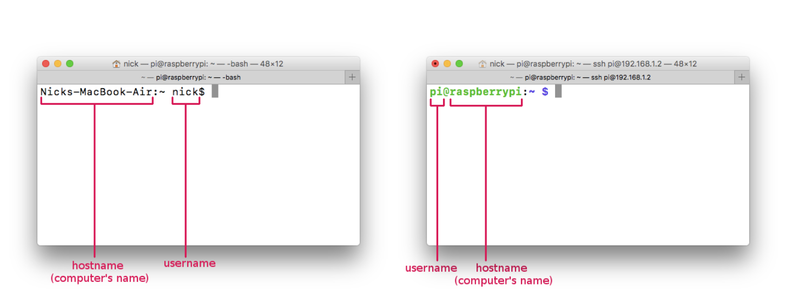

# the Command Line Interface (CLI)
### (aka terminal, aka shell)

*NOTE: it's important that u already understand how to write [file-paths](../file-paths) before reviewing these notes*

u typically interact w/ur computer's operating system through it's GUI (Graphical User Interface), u open directories by double clicking on the folder icons && u run programs by double-clicking on the app icons, u move windows around by clicking+dragging && open up "context" menu's by right-mouse clicking (or double-finger clicking on Mac trackpads).

But before there were GUIs there were CLIs or Command Line Interfaces. a CLI is another way of interacting with ur computer's operating system, in the CLI u can typically do everything that u can do in the GUI && MORE!!! as was mentioned in the video above, the CLI is still used regularly by programmers to do things like access+control remote computers (anywhere in the world) && building+running custom software. getting comfortable with the Command Line means u'll be able to transcend the restrictions of the consumer-oriented interfaces of the "desktop" metaphor.

the instructions below assume u're using a UNIX-like operating system, like the kinds u find on Macs or Linux PCs like Raspberry Pi && most "cloud" computers (think servers)... essentially mostly everything except Windows (*Windows has a CLI but it's totally different, not very Unix-like && since we're all on Mac we'll focus on that*)

## The Terminal

let's start by opening up our "**terminal**", this is the app on Mac && Linux systems that give us access to our operating system's command line or "**shell**". On mac u can find this in ur Applications or by typing "terminal" into ur spotlight search. u can have multiple terminals open (or terminal tabs open), each is referred to as a "**terminal session**".

what u'll see is a **command prompt**, this will contain a `$` symbol, to the left of it u'll see the following information: the **hostname** (the name of the computer u're controlling), the **username** (the name of the user u are logged into this computer as) && some reference to the folder u are currently in (usually relative2 to ur home directory). to the right of the `$` is where u'll type in ur commands

## Running Commands
#### (&& quitting a process)

in order to run a **command** (which is what we call programs in the terminal) just type in the name of the command && press enter.

for example type in `pwd` && press enter. what will happen is ur computer will run the "pwd" command, which will print the full absolute path of the folder ur terminal session is currently in (ie. the "present working directory") && then the program will "exit" (which means it finished running && quit). u'll then be returned to a new command prompt (that's how u know the program finished && quit). another simple command is `ls`, this will list all the files + folders in ur present working directory.

not all commands quit on their own, some will keep running until u force it to stop. when a program is currently running (whether its in the GUI in the CLI or something that just runs in the background automatically) it's called a **process**. u can usually  stop a process that u launched in a terminal by pressing **cntrl + c** (that works for most commands, if that doesn't work trying pressing **q** instead).

take the `ping` command for example. this command is used to test ur network connection, it will send a simple packet known as an "echo request", which (like the name implies) tells the server of a website ur pinging to "echo" back a packet && it will measure the time it took to get from ur computer to the server && back. the ping command takes the url of a website as an argument, for example `ping google.com`. if u run that command u'll notice data from each echo request list in the terminal one by one. the data includes info like the IP address of the server u are pining, as well as the time it took (in milliseconds) to make the round trip. u'll have to interupt the process urself with **cntrl + c** in order to stop pinging.

*SIDE NOTE:* there's a command called `ps` which u can use to view all the processes currently running on ur computer, to see a snapshot of 'em all run `ps aux`. the `kill` && `pkill` commands can be used to stop any of the process currently running in the background (CLI version of "force quit").

### Command Options

most commands (ie. command line programs) have different **options** which dictate how/what the program should do when it runs. these options are written after the command (preceded by a space) && will often start w/a `-` or `--`.

for example, the `ls` command doesn't show u any hidden folders/files by default, in order to list both visible + hidden run the `ls` command with the all option like this: `ls --all` or `ls -a` for short. sometimes these are also called **flags**.

*SIDE NOTE*: unless u had hidden files in this directory u're unlikely to notice a difference in the results except for two things a single `.` && a double `..`. the single `.` represents the current directory while the `..` represents the parent directory (this should sound familiar given what u know about writing relative paths)

another useful option/flag for the `ls` command is `-l` which will list the folders && files along with more information about them including their permission settings, the user who created the file, file size && the date it was last modified. u can use both the `-l` + `-a` options like this: `ls -l -a` or u can combine the flags like this `ls -la` (or like this `ls -al`, the order doesn't matter)

though each command has it's own options/flags, one they usually all have is `--help` (sometimes also`-h` for short). this shows the "help" instructions which usually lists all the options/flags a particular command has, for ex: `ls --help`.

*SIDE NOTE:*: in addition to the help file, most CLI programs come w/a manual which can be read using the `man` command (short for manual), for ex: `man ls` or `man ping` (use the arrow keys to scroll through the manual && **q** to quit)

### Command Arguments

some commands take **arguments** (aka parameters), which are similar to options in that it tells the program something about the way it should run, but unlike options which are specifically defined letters/words, arguments are usually variable. for example, the command `cd` is used to "change directory" from ur present working directory (pwd) to another. if no argument is specified `cd` will change navigate the current terminal session to the user's home folder. if there's a specific directory u want to navigate to u pass a path as an argument, this can be either an absolute path or a path relative to ur pwd. for example: `cd /Users/nick/Downloads` will change the pwd of my terminal session to my users's "Downloads" folder, so if were to use the ls command now, it would list the contents of my Downloads folder.

*SIDE NOTE*: u will often see people use the `~` when writing paths in the terminal, this is a special shortcut for the home folder of the currently logged in user. so for ex, if u are on a mac && u're logged in as "nick", then typing `~` is the same as typing `/Users/nick`, so running `cd ~/Desktop` is the same as running `cd /Users/nick/Desktop`.

*SIDE NOTE*: so far none of the folders && file names we've discussed have had spaces... when they do there's a couple ways to deal with them. say u need to navigate into a file in ur Documents folder called "class notes" w/a space between the two words. u CAN NOT do this: `cd /Users/nick/Documents/class notes` because it assumes u're trying to navigate into a folder called class && interprets the word *notes* as a second argument. instead u have two options: first, u can surround the entire argument (in this case the directory path) in quotes like this: `cd "/Users/nick/Documents/class notes"`, or, alternatively, u can escape the space by preceding it with a `\` symbol, this tell the terminal to interpret the space as the "space character" rather than as a space between arguments, like this: `cd /Users/nick/Documents/class\ notes`

### Options + Arguments

some commands can take both options && arguments, in these situations u usually write the options before the arguments. for example, we already learned that the `-l` option in the `ls` command lists information about the files in a directory. if u only want to see the information of a particular file in the pwd u can pass ls a filename as an argument, the full pattern looks like this `ls [options] [argument]` for example: `ls -l doge.png`

in some cases u might have options/flags which require an arguments && so u end up w/a pattern that looks more like `[command] [option] [argument] [option] [argument]`. take the `ping` command for example. rather than running forever until u force quit the process urself, u can pass the `-c` option (short for count) followed by the number of echo requests u want to send. ping also has another option `-i` to specify the time in seconds between each interval, so if i wanted to send 3 echo requests with 2 seconds between each i would write `ping google.com -c 3 -i 2`

### other useful notes...

i've already mentioned that the `man` command as well as the `--help` option are great ways to learn about a particular command, but don't forget most of these are also well documented on the Internet (&& more info is just a search away). i've also mentioned (but it's worth reiterating) that **cntrl + c** is the most common way to quit a process (if that fails, try **q**).

sometimes a command will require admin privileges (for example if u want to install something u always need to type in ur password), if u try to run a command that requires admin (or "root") privileges the command will usually fail && print (display in the terminal) an error message that says something like "requires root" or "requires admin privileges". to run a command with admin privileges u must put the word `sudo` ("super user do..."), it will then ask u to type in ur password, **NOTE:** when u type a password in the terminal u won't see what ur typing (nor will u see dots or `****` symbols) but rest assured, the terminal is registering ur key presses, so simply type the password && hit enter. for example, there is a command called `reboot` which restarts ur computer, but it requires a password, so u must run `sudo reboot` for it to work.

using the command line inevitably involves a lot of typing... this can get annoying, but there are a couple of useful shortcuts to minimize the amount of typing u have to do. the terminal keeps a history of every command u run (u can run the `history` command to see it), if u press the UP && DOWN arrows at any point u can go back/forward through this history. often times u just want to rerun the last command (maybe w/a slight edit) tapping the UP arrow will save u lots of time. another useful shortcut is the TAB key, when u are writing a path or filename the TAB key can be used to auto-complete, but u have to write enough of the name so that it knows what u want to auto complete, for example typing in `cd ~/Do` wont' auto-complete b/c u might be trying to type "Documents" or "Downloads" but typing `cd ~/Doc` && hitting TAB will auto-complete to `cd ~/Documents`

## Example Commands

### getting around && finding stuff

`pwd` (**present working directory**) though this information can usually be gleaned from the command prompt itself, it's nice to know this command exists

`whoami` (**who am i?**) this will tell u the user u are currently logged in as, though this too is something the command prompt usually also includes.

`cd` (**change directory**) is used to change the directory (aka folder) u are presently in (ie. ur pwd or present working directory), the pattern is typically `cd [path]`

| example                  | description                               |
|:------------------------:|:-----------------------------------------:|
| `cd`                     | navigate to home folder by default        |
| `cd /Users/nick/Desktop` | navigate to the desktop                   |
| `cd ~/Desktop`           | same, but with `~` home folder shortcut   |

`ls` (**list directory contents**) this command will list all the contents of a particular directory (it will list the stuff in the pwd by default), pattern is usually `ls [options] [path]`

| example                  | description                               |
|:------------------------:|:-----------------------------------------:|
| `ls`                     | list contents of pwd by default           |
| `ls -l`                  | list contents && meta-data                |
| `cd -l ~/Desktop`        | list contents && meta-data of the Desktop |

`find` (**find files**) this command can be used to find files on ur harddrive. u pass it two parameters: the first argument is the directory u want to search in && second, the option `-name` followed by the name of the file u want to find as an argument. so the pattern usually looks like this `find [path to search in] -name [file to search for]` if we want to search the directory we are currently in (ie. our pwd) we can simply pass a `.` as the directory (which u may recall means the current directory), && if u don't know the full name of the file, u can use the `*` or "wildcard" (which u can use in most commands) to fill in the spot u're not sure of, for example if u know u're looking for an image called "cat" but can't remember what file type it is (jpg? png?) u can say `cat.*` or say u're looking for a pdf but can't remember what it's called u can say `*.pdf` or maybe u remember the pdf started with "SAIC" followed by some other stuff u can't remember, u can write `SAIC*.pdf`.

| example                      | description                               |
|:----------------------------:|:-----------------------------------------:|
| `find . -name cat.jpg`       | find a file called cat.jpg in the pwd (or in it's sub folders) |
| `find ~/Desktop -name *.pdf` | find all the pdfs on the desktop (or it's sub folders)         |

``

`cat` (**concatenate file**) this will print (aka display in the terminal) the content of a particular file, pattern is `cat [options] [path to file]`

| example                   | description                               |
|:-------------------------:|:-----------------------------------------:|
| `cat notes.txt`           | print the contents of a file called notes.txt in the pwd |
| `cat ~/Desktop/notes.txt` | print contents of a file called notes.txt on the desktop |

`grep` (**globally search a regular expression && print**) u can use grep when u're looking for a specific thing u wrote in a specific file. u can pass a pattern or string of text u want to locate followed by the filename u want to search, the pattern is usually like this `grep [options] [pattern] [file]` where "pattern" could just be a string of text like "cat memes" or something called a [regular expression](https://en.wikipedia.org/wiki/Regular_expression) the latter is VERY useful (but beyond the scope of these notes)

| example                   | description                               |
|:-------------------------:|:-----------------------------------------:|
| `grep "cat memes" my-notes.txt` | print every line in the document that matches the search pattern. |

### making stuff

`mkdir` (**make directory**) this command is used to create a directory (ie. folder), the pattern is `mkdir [path-to-new-folder]`. there is also a command called  `rmdir` used to "remove a directory" (but this only works if the folder is empty, if it isn't u'll need to use the `rm` command)

| example                   | description                               |
|:-------------------------:|:-----------------------------------------:|
| `mkdir ~/Documents/cat-memes` | creates a folder called 'cat-memes' in Documents |
| `mkdir cat-memes` | creates a folder called 'cat-memes' in pwd |

`rm` (**remove**) this is how we delete folders && files, the pattern is usually `rm [path-to-file]`. if u are using it to delete a folder that's got other stuff in it u'll need to use the `-f` flag which will "force" the delete as well as the `-r` to "recursively" delete all sub-directories inside the specified folder.

| example                   | description                               |
|:-------------------------:|:-----------------------------------------:|
| `rm ~/Desktop/cat.jpg` | removes a file called cat.jpg from the desktop |
|`rm -rf cat-memes` | removes a folder called cat-memes in pwd as well as everything inside |

**WARNING**: be very careful w/this command! unlike moving items to the "trash can" this will delete the files permanently! there's a very cruel joke on the Internet where folks will tell people on forums to type in `rm -rf /` NEVER DO THIS, if u read that command carefully u'll notice it's telling ur computer to delete everything inside the `/` folder (ur root directory)... essentially this wipes ur computer :(

`mv` (**move**) this command can be used to move (ie. cut + paste) files, the pattern is `mv [old-path] [new-path]` (u can also pass optional options/flags which u can look up in the man page or help file).

| example                   | description                               |
|:-------------------------:|:-----------------------------------------:|
| `mv cat.jpg ~/Documents/cat.jpg` | move file called cat.jpg in pwd over to the Documents folder|

`cp` (**copy**) this command can be used to copy + paste files, the pattern is just like `mv`, which is `cp [old-path] [new-path]` (it also has optional options/flags)

| example                   | description                               |
|:-------------------------:|:-----------------------------------------:|
| `cp cat.jpg ~/Documents/cat.jpg` | just like mv example, except the original file won't get removed |

`touch` this command is used to change a file's access && modification times. u can read more about how that works in the man page (`man touch`) but i mention it here b/c it's often used simply to create files w/the following pattern `touch [path-to-new-file]`. keep in mind the files will always be empty, just b/c u create a jpg w/`touch` doesn't mean it contains image data... it won't.

| example                   | description                               |
|:-------------------------:|:-----------------------------------------:|
| `touch test.txt` | creates an empty file called test.txt in the pwd |

`nano` (**text/code editor**) most programming takes place in a code editor && typically we'll be using GUI code editors like Atom, SublimeText or VSCode. but if u ever need to create or edit a file through the command line (say for example b/c u are logged into a server through a terminal) u can use nano which is "ANOther" text/code editor, except it's for the CLI not the GUI. pattern is usually `nano [path-to-file]` (if the file doesn't exist it'll create a new file w/the specified name at the specified path)

| example                   | description                               |
|:-------------------------:|:-----------------------------------------:|
| `nano test.txt` | opens the test.txt file on the pwd (or creates it) |
| **cntrl + x** | quit nano (u will be asked if u want to save changes) |

### networking commands

| example                   | description                               |
|:-------------------------:|:-----------------------------------------:|
| `ping google.com` | starts sending pings to google w/1 second intervals  |
| `ping -c 3 -i 0.5 google.com` | ping google 3 times at half second intervals |

`whois` is a command for looking up information in the public "whois" directory which lists the information behind a person or company which registered a particular domain name (assuming they haven't done so "privately"), pattern is `whois [domain-name]`

| example                   | description                               |
|:-------------------------:|:-----------------------------------------:|
| `whois google.com` | prints google's registery info  |

`nslookup` (**name server lookup**) this command is for looking up the IP address behind a given domain name, this is the same thing ur computer has to do when u're online before it can send a request to the actual server behind that domain name. pattern is `nslookup [domain-name]`

| example                   | description                               |
|:-------------------------:|:-----------------------------------------:|
| `nslookup google.com` | prints google's IP address  |

`ping` as mentioned before, this command is used to test ur network connection (read more about it at the top of this page, or as usual in the `man ping` page or `ping --help` file), pattern is `ping [options] [website-to-ping]`

`traceroute` is a command line tool for "tracing the route" ur internet packet's take from ur computer to the server u are requesting stuff from. it will print the IP address && other info of every computer (typically routers) that u packet goes through as the request gets passed along from device to device over the Internet until it reaches it's destintaion address. pattern is `traceroute [website-to-trace]` (there is a nicer version called `mtr` "my traceroute" but u have to install this one urself, see "installing new commands" below)

| example                   | description                               |
|:-------------------------:|:-----------------------------------------:|
| `traceroute google.com` | print IP addresses of devices we hop through to get to google |

`curl` (**client URL**) is a command for requesting files at a particular URL (universal/uniform resource locator). one common way to use the Internet is to setup up a "client / server" relationship between computers (the web is a great example of this) where one computer acts as a "server" which has some resource (files, data, app, etc) listening/waiting for requests from "clients" which are the computers that want to get a copy of the resource over the Internet. the pattern is `curl [URL]`. another popular/similar command is `wget` but this doesn't come preinstalled on Mac (see "installing new commands" below)

| example                   | description                               |
|:-------------------------:|:-----------------------------------------:|
| `curl www.google.com/robots.txt` | print the robots.txt file to terminal |
| `curl google.com > google.html` | save google's home page to pwd |

*NOTE:* that last example uses "command redirection" see section below for more info

`telnet` this is an Internet client command from back in the ARPANET days (but still works!), u can use it to "visit" old (&& new!) BBSs ([Bulletin Board Systems](https://en.wikipedia.org/wiki/Bulletin_board_system)), check out this directory of active BBs [https://www.telnetbbsguide.com/](https://www.telnetbbsguide.com/). the pattern is `telnet [domain-name] [port]`

| example                   | description                               |
|:-------------------------:|:-----------------------------------------:|
| `telnet mysticdungeon.club 1666` | log into the mystic dungeon BBS text adventure |

`ssh` (**secure shell**) is a command for logging into the terminal of another computer connected to the Internet. u typically need credentials (the username && password or ssh-keys) to successfully log in. when u log into another machine ur command prompt will update to reflect that of the terminal of the machine u are now logged into. we'll be using this to log into servers or other computers in our network (like raspberry pis), the pattern is `ssh [username]@[ip-address-or-domain-name]`. to log out && back into ur terminal simply run `exit`.

| example                   | description                               |
|:-------------------------:|:-----------------------------------------:|
| `ssh pi@192.168.0.1` | log into a computer at that local IP address w/the username "pi" |

**running a web server on ur computer** just like we will be using the `node` interpreter to run our JavaScript code, folks who program in python use the `python` interpreter. though we won't be writing python code, the python interpreter comes w/a useful module for quickly running a web server, typically u would `cd` into ur website's folder && then run `python -m SimpleHTTPServer` (if thta doesn't work however, u may have a different version of python, instead try `python -m http.server`)

`ifconfig` is used to "configure network interfaces", ie. the parts of ur computer that connect to networks (maybe a wifi card, maybe a network card w/an ethernet port on it, maybe both). that said, it's often used simply to list all of ur computer's network interfaces && meta-data (like what the local IP addresses assigned to them from the router are), to see this list simply run `ifconfig` (there is a similar tool just for wireless devices called `iwconfig` but that is not installed by default on Mac)

`nmap` (**network map**) is a command used to scan a network && see what devices are connected as well as what ports are open. it's great for finding the IP address of devices u plugged into ur network that u might want to connect to via ssh (like a raspberry pi for example)... but it's also great for just generally scoping out a network.

| example                   | description                               |
|:-------------------------:|:-----------------------------------------:|
| `nmap -sP 192.168.0.0/24` | will look up all the machines logged into the local network in the 192.168.0.? range |
| `sudo nmap -sP 192.168.0.0/24` | same as above but u also get MAC address && vendor info of devices |
| `sudo nmap -O 192.168.0.12` | get info (OS, open ports, etc) of a specific device on the network |

### installing new commands

There are soooo many other command line tools out there, including tools for doing things like editing photos like `imagemagick` (think Photoshop for terminal) && videos like `ffmpeg` (think Premiere for terminal) but u'll have to install them urself. there are command line tools for installing new tools, these are called "package managers" (think app store for terminal), on Linux it's called `apt-get`, u simply run `sudo apt-get install [name-of-package]`, Mac does not come w/a package manager, but u can install a popular one called [homebrew](https://brew.sh/) by following the instructions on their website. check out new media artist && educator Ted Davis's page on [CLI for Artists + Designers](https://ffd8.github.io/cli-for-artists-and-designers/) for more on these && other tools.

## Command Redirection

each command line tool can technically/generally accept input via what's called "standard in" && spits out the result via "standard out" (unless there was an error in which case it responds via "standard error"). if u run commands like we have been the "standard out" && the "standard error" simply print to the terminal, but u could alternatively redirect that output to a file using the `>` symbol. say for example u wanted to download a zip file from a website, if u did `curl website.com/archive.zip` the compressed data of the zip file will just barf out into ur terminal (that's useless to u) but if u run `curl website.com/archive.zip > ~/Desktop/archive.zip` then u will save the actual zip file to ur Desktop (from there u could unzip it as per usual).

another redirection technique is to "pipe" the standard output of one command into the standard input of another using the `|` symbol. this can be a very powerful tool as u can create all kinds of complicated chains! for example, say u wanted to list all the files in a directory that were modified in August, we know that `ls -la` will list all the files in a directory (including the date last modified), we can "pipe" the outputed list into `grep` to filter for only the lines with "Aug" in them like this: `ls -la | grep "Aug"`, or say for example u know that a while back u used the `nmap` tool to scan for something specific, but can't remember exactly what options u used. u could run `history` && search through the list manually, or u could simply run `history | grep "nmap"` && only print the nmap commands that are in ur history. it's also worth noting u can chain as many pipes (one after the other) as u'd like.
