# CSS Art Gallery

[Waiting For Somebody](https://codepen.io/CameronFitzwilliam/pen/boJEJG) by Cameron Fitzwilliam
-- *HTML (pug) + CSS (scss)*

[CSS Geometric Fox](https://codepen.io/cassidoo/pen/mpOPqN) by Cassidy Williams
-- *HTML (haml) + CSS (less)*

[CSS 3D Bouncy Castle](https://codepen.io/steveeeie/pen/aEqZaz) by  Steve Meredith
-- *HTML + CSS (scss)*

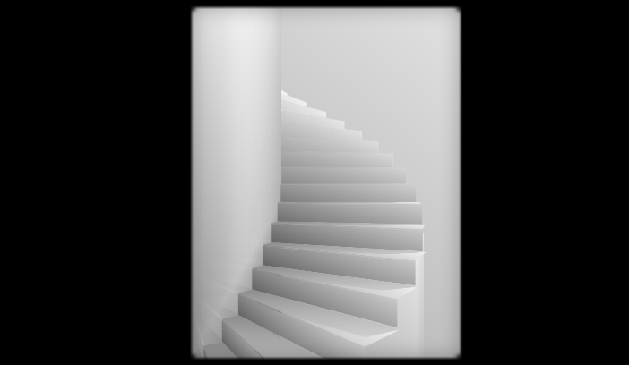

[Only CSS: Infinite Steps](https://codepen.io/YusukeNakaya/pen/rJxevm) by  Yusuke Nakaya
-- *HTML (pug) + CSS (scss)*

[CSS Illustration face](https://codepen.io/WhitePallet/pen/QQmzjW) by  white pallet
-- *HTML + CSS*

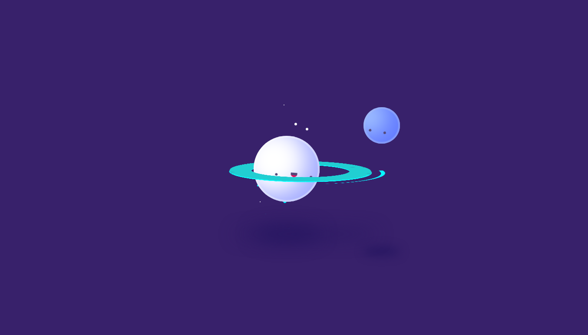

[Saturn Hula Hooping](https://codepen.io/jcoulterdesign/pen/BrdPaw) by  Jamie Coulter
-- *HTML (haml) + CSS (scss)*

[css eye animations](https://codepen.io/creme/pen/rdjXav) by  creme
-- *HTML + CSS (scss)*

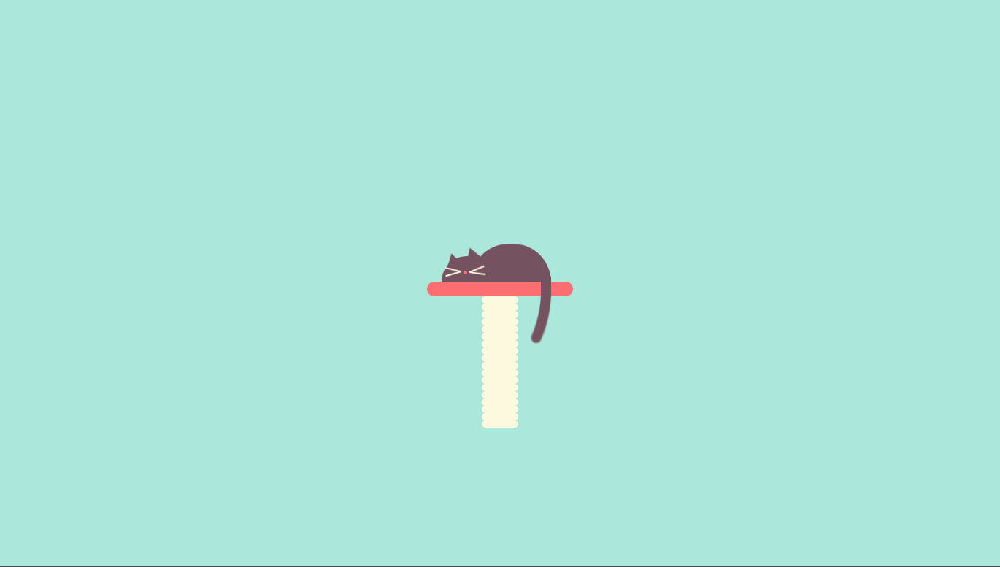

[Sleeping Cat CSS drawing/animation](https://codepen.io/agoodwin/pen/ypeWYE) by  Anastasia Goodwin
-- *HTML + CSS (scss)*

[Painting dreams galaxy](https://codepen.io/judag/pen/QmZMZb) by Judith Neumann
-- *HTML + CSS*

[Single Element Pure CSS MacBook Pro](https://codepen.io/joshnh/pen/JCGoF) by Joshua Hibbert
-- *HTML + CSS*

[CSS Cheerful Pineapple](https://codepen.io/Elwend/pen/qoLqap) by Liz Wendling
-- *HTML + CSS (scss)*

[Tappy loader](https://codepen.io/ste-vg/pen/pKNjZE) by Steve Gardner
-- *HTML + CSS (scss)*

[CSS Bear Toggle](https://codepen.io/agoodwin/pen/gKpKqw) by Anastasia Goodwin
-- *HTML + CSS (scss)*

[Pure CSS Cards Against Devepers](https://codepen.io/jh3y/pen/JZbKpp) by Jhey
-- *HTML (pug) + CSS (stylus)*

[1 Element CSS Spinners](https://codepen.io/Paolo-Duzioni/pen/ZoRabJ) by Paolo Duzioni
-- *HTML (pug) + CSS (scss)*

[Real Time Moon](https://codepen.io/burkeholland/pen/yEEdMQ) by Burke Holland
-- *HTML + CSS*

[Alfa Romeo 1969](https://codepen.io/kristinadinellari/pen/GGPzrO) by Kristina
-- *HTML + CSS (scss)*

[CSS Doodles](https://codepen.io/agathaco/pen/RJEyGP) by agathaco
-- *HTML (pug) + CSS (scss)*

[Pure CSS "Moustached Nanny"](https://codepen.io/miocene/pen/mjLPVp) by Julia Miocene
-- *HTML + CSS (postcss)*

[CSS Flamingo](https://codepen.io/Octavector/pen/KBrGvW) by Octavector
-- *HTML (pug) + CSS*

[CSS Illustration #1 - Bicycle](https://codepen.io/AlbertFeynman/pen/pZxPOV) by Jove Angelevski
-- *HTML + CSS (scss)*

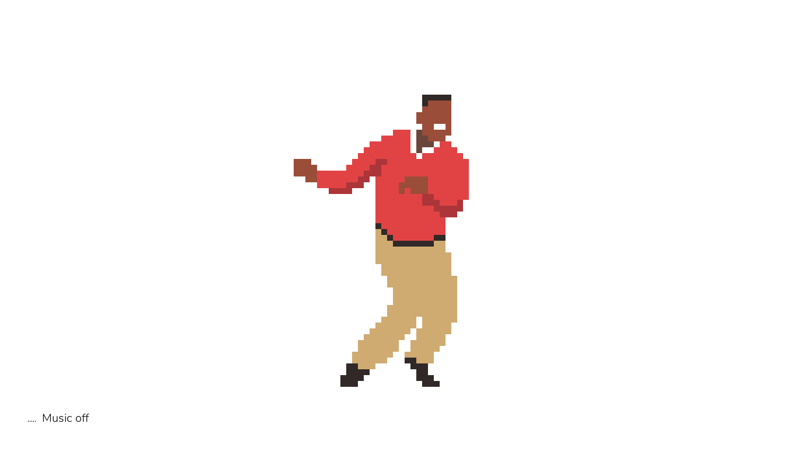

[Pure CSS The Carlton dance](https://codepen.io/Wujek_Greg/pen/EpJwaj) by Grzegorz Witczak
-- *HTML + CSS (scss)*

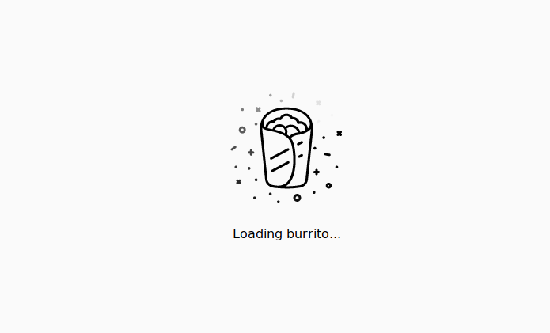

[Magic Burrito](https://codepen.io/codyogden/pen/qxjKKy) by Cody Ogden
-- *HTML + CSS (scss)*

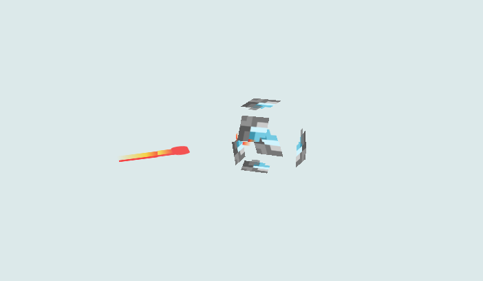

[CSS Fireballs & Particles](https://codepen.io/pgalor/pen/YjbxmW) by Piotr Galor
-- *HTML + CSS*

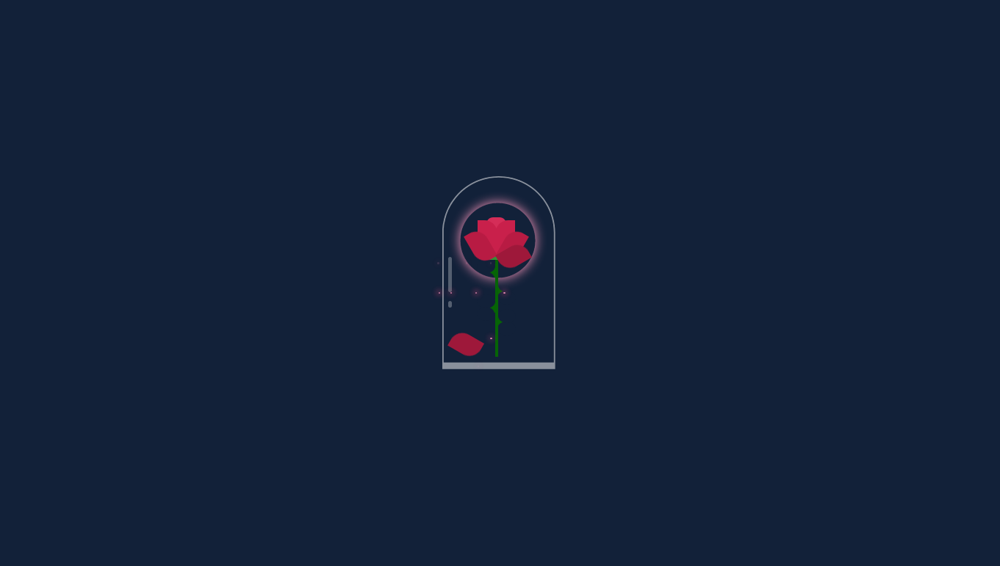

[Enchanted Rose](https://codepen.io/maaarj/pen/gmNeXd) by Marjo Sobrecara
-- *HTML + CSS (scss)*

[Planets](https://codepen.io/maaarj/pen/YZLEBM) by Marjo Sobrecaray
-- *HTML + CSS (scss)*

[Glowing Meteor](https://codepen.io/maaarj/pen/KWNLaO) by Marjo Sobrecaray
-- *HTML + CSS (scss)*

[CSS Corgi Dog Love](https://codepen.io/Kozelskiy/pen/QpYooq) by Pavel Kozelskiy
-- *HTML + CSS (scss)*

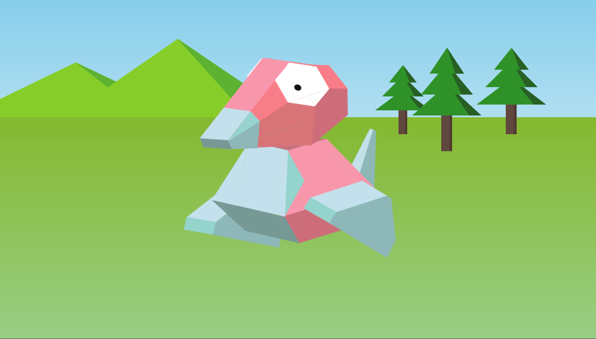

[CSS Porygon](https://codepen.io/daviddeejjames/pen/MqRveg) by David James
-- *HTML + CSS (scss)*

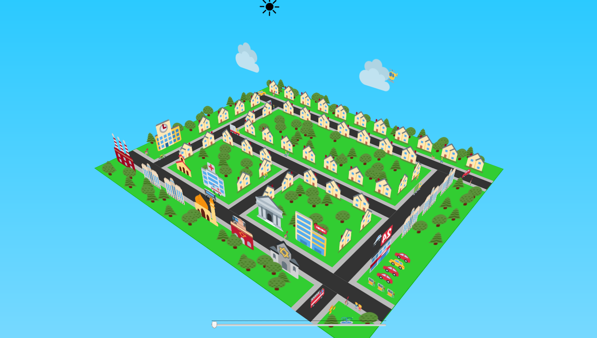

[3D Emoji Town (Pure CSS)](https://codepen.io/GeorgePark/pen/MqVoYP) by George W. Park
-- *HTML + CSS*

[The Mine: No JS, CSS only adventure game](https://codepen.io/jcoulterdesign/pen/NOMeEb) by  Jamie Coulter
-- *HTML (haml) + CSS (scss)*

[#02animation: seals](https://codepen.io/eyesight/pen/ePyozL) by Claudia
-- *HTML + CSS (scss)*

[CSS-Only Walking Dog](https://codepen.io/davidkpiano/pen/BGxgLa) by David Khourshid
-- *HTML + CSS (scss)*

[Only CSS: Shooting Star](https://codepen.io/YusukeNakaya/pen/XyOaBj) by Yusuke Nakaya
-- *HTML (pug) + CSS (scss)*

[Pure CSS Bojack Horseman 🐴👍](https://codepen.io/jh3y/pen/pGezBz) by Jhey
-- *HTML (pug) + CSS (stylus)*

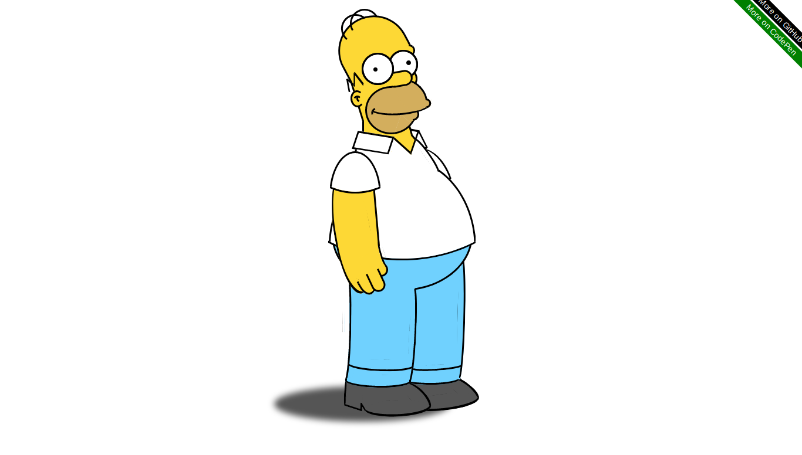

[CSS Homer Simpson](https://codepen.io/alvaromontoro/pen/rPazmv) by Alvaro Montoro
-- *HTML + CSS*

[Couple Kittes :)](https://codepen.io/justyouraverageonion/pen/ErmNPJ) by JustYourAverageOnion
-- *HTML + CSS*

[Day 5: Sun Blocked: Solar Eclipse Explained](https://codepen.io/acupoftee/pen/ErooQj) by Tee
-- *HTML + CSS*

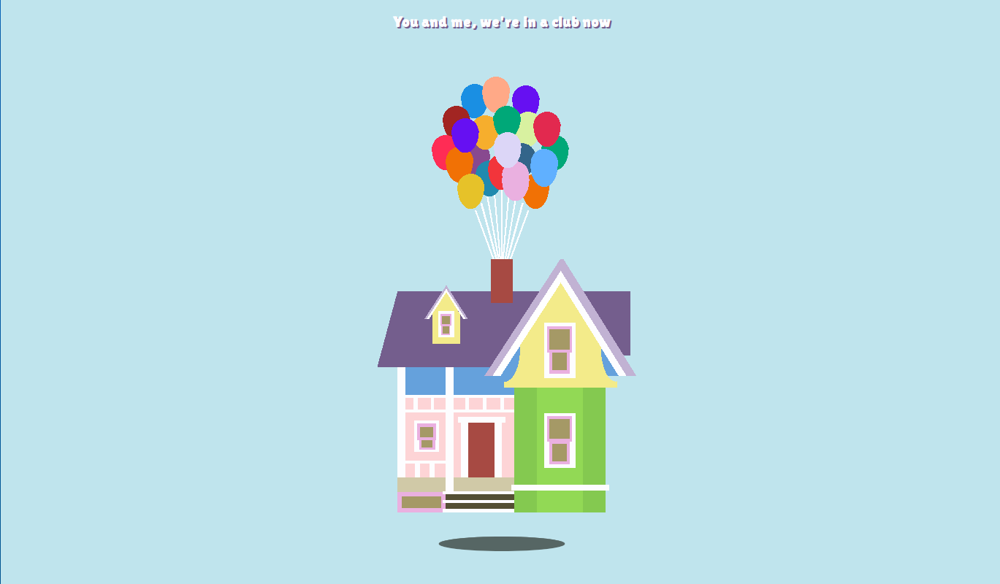

[Pure CSS Single Div Up House!](https://codepen.io/pbmasigla/pen/aMRwXV) by Patricia Masigla
-- *HTML + CSS (scss)*

[Pure CSS Emoji Carousel 🎠](https://codepen.io/jh3y/pen/qwqOwK) by Jhey
-- *HTML (pug) + CSS (stylus)*

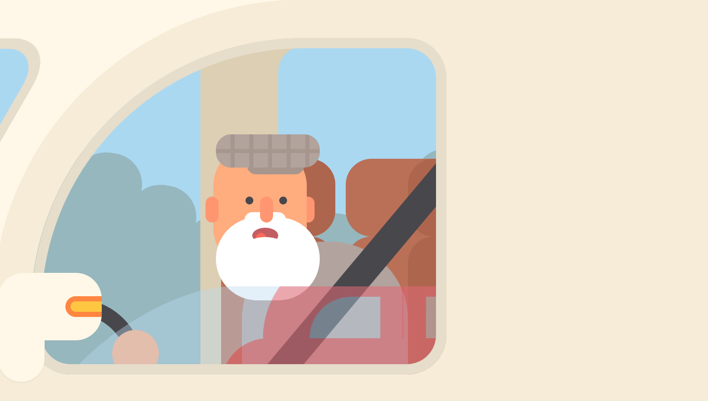

[CSS Pure | Fast Lane](https://codepen.io/kotAndy/pen/wZgKyO) by Andy
-- *HTML (pug) + CSS (stylus)*

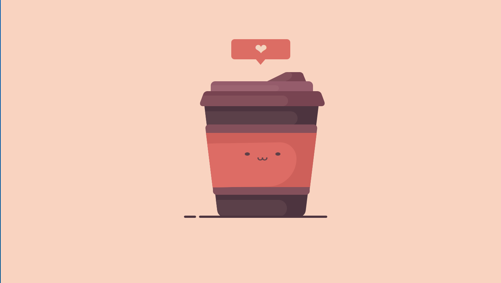

[Pure CSS Cute Cup](https://codepen.io/keirafoxy/pen/JgdBVW) by Lilya Zilyukina
-- *HTML + CSS (postcss)*

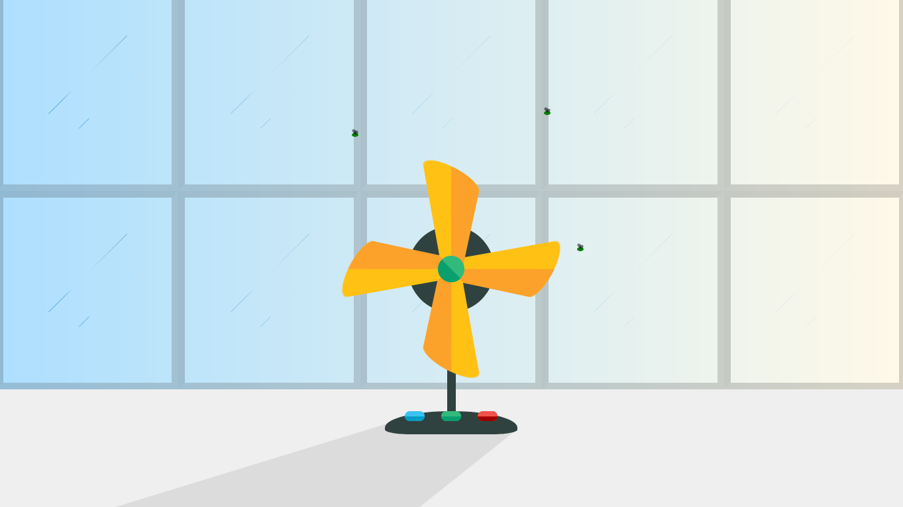

[CSS Only - Fan Animation](https://codepen.io/mrlaseptima/pen/vYBGebX) by Amin moslemi
-- *HTML + CSS*

[Deet](https://codepen.io/KristopherVanSant/pen/vYBrZrM) by Kristopher Van Sant
-- *HTML + CSS*

[Old Clock](https://codepen.io/Adir-SL/pen/JzrLQp) by Adir
-- *HTML + CSS*

[UFO Pure CSS](https://codepen.io/cluzier/pen/yLBGLGW) by Conner
-- *HTML (haml) + CSS*

[Eggs](https://codepen.io/Adir-SL/pen/EGmeBm) by Adir
-- *HTML + CSS*

[CSS only flying page animation](https://codepen.io/team/keyframers/pen/YzKjoev) by keyframers
-- *HTML + CSS (scss)*

[Earthchan](https://codepen.io/CodeMeNatalie/pen/gOYQdVV) by Natalie
-- *HTML + CSS (scss)*

[With your eyes closed](https://codepen.io/tiffachoo/pen/zgOVmE) by tiffany choong
-- *HTML + CSS (scss)*

[Times of day CSS paintings](https://codepen.io/pieter-biesemans/pen/vxGNQe) by Pieter Biesemans
-- *HTML + CSS (scss)*

[Only CSS: Paper Bird](https://codepen.io/YusukeNakaya/pen/BwBgvq) by Yusuke Nakaya
-- *HTML (pug) + CSS (scss)*

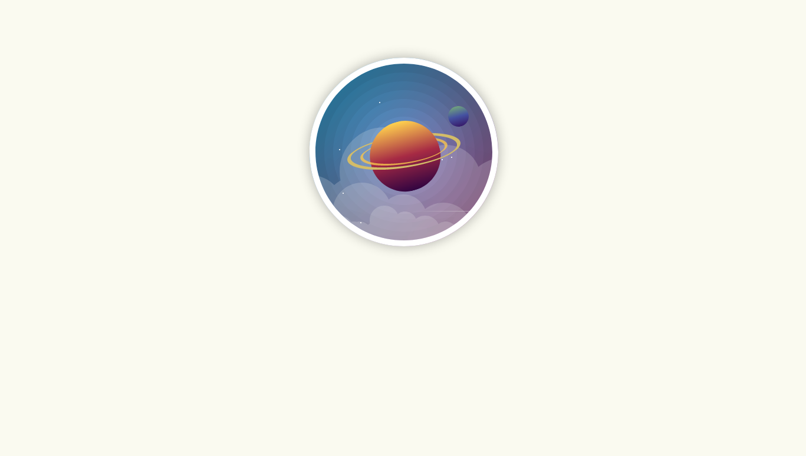

[planet pen](https://codepen.io/srekoble/pen/RLpNVJ) by Vangel Tzo
-- *HTML + CSS (scss)*

[Daily CSS Images 5 - Dory](https://codepen.io/vicbergquist/pen/Kvgomo) by Victoria Bergquist
-- *HTML + CSS (scss)*

[Daily CSS Images 13 - Taco](https://codepen.io/vicbergquist/pen/ZJXROr) by Victoria Bergquist
-- *HTML + CSS (scss)*

[CSS: Cat Swinging on String](url) by author
-- *HTML + CSS (scss)*

[CSS coffee animation](https://codepen.io/agathaco/pen/bRxYxL) by agathaco
-- *HTML (pug) + CSS (scss)*

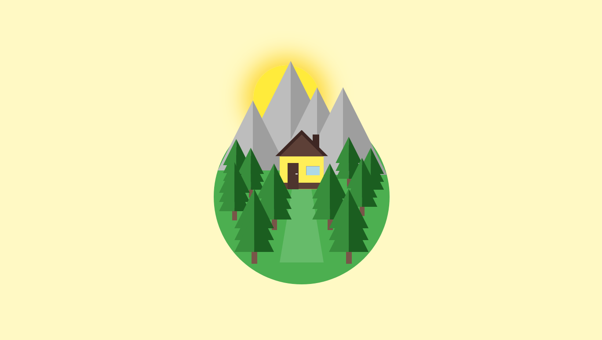

[Flat Forest (CSS only)](https://codepen.io/nicolasraube/pen/OgoeGx) by Nicolas Raube
-- *HTML + CSS*

[CSS animation - Dancing pug](https://codepen.io/AngelaVelasquez/pen/mwvoXa) by  Angela Velasquez
-- *HTML (pug) + CSS (scss)*

## What is Pug? Haml? SCSS? less? etc.

u might have noticed that not all of these sketches uses the HTML && CSS we're used to && instead use variations like "PUG" or "LESS." these variations go by different names but are generally referred to as **preprocessors.** these are variations on HTML && CSS which use different **syntax** && different ways of writing ur code. some developers prefer these variations on HTML && CSS b/c it helps them write code faster, the catch is that it sometimes feels like learning a whole new language (so there's an initial investment + learning curve). at the end of the day, the code that runs in the browser (ie. the code u deploy on a server) always needs to be regular HTML && CSS, so when u are useing a preprocessor, at some point u need to turn it into good old HTML && CSS.

A few popular HTML preprocessors are [Pug](https://pugjs.org/api/getting-started.html), [Haml](http://haml.info/), [Slim](http://slim-lang.com/) && a few popular CSS preprocessors are [less](http://lesscss.org/) [Sass](https://sass-lang.com/), [stylus](http://stylus-lang.com/) && [PostCSS](https://postcss.org/).
