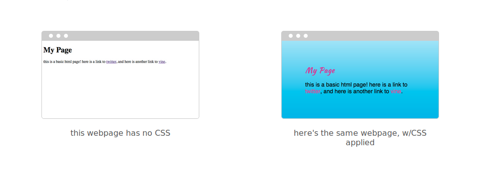
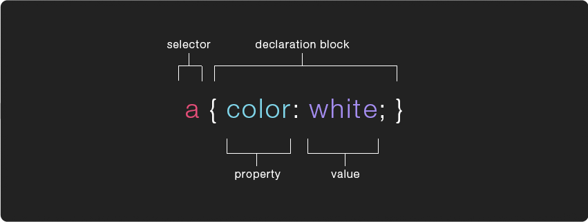
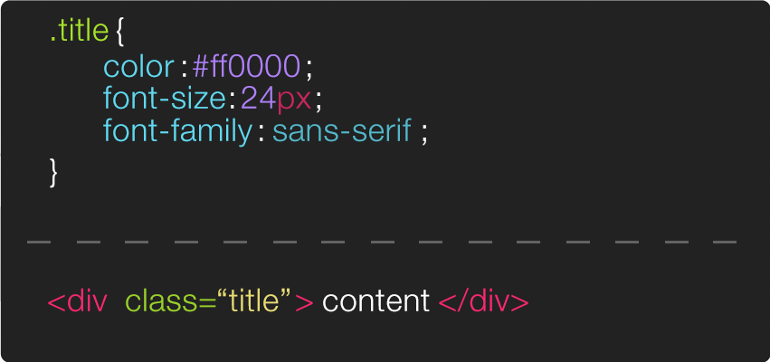

# Cascading Style Sheets (CSS)

the point of CSS ( Cascading Style Sheets ) is to separate “presentation” (CSS) from “content” (HTML). the separation of a document’s content and its presentation is a popular tech-design philosophy/methodology. it means u can display the same content (HTML) in different ways (w/different styles) for different contexts: laptops, smart phones, in print, on a braille tactile device, etc. it also means a text-to-speech app can understand what’s “content” && what’s not + reader-views/apps can override the default CSS && use alternative “presentations”. depending on how u implement ur CSS, it also enables u to make site-wide changes in a single document which can make updating (even redesigning the entire aesthetic) a site drastically easier.



# CSS Rules

a CSS "rule" (colloquially referred to as a CSS “class”) contains two parts, a **selector** which specifies which element(s) the rules will be applied to + a `{` **declaration block** `}`, surrounded by curly brackets, which specifies how the element should be styled.

the declaration is split in two parts, the **property** which indicates the aspect of the element u want to change ( ex: color, font, width, border ) && the **value** which is the setting u want to use for that specific property.



the example above uses a **type selector**, which means it will apply the rules to every `<a>` tag on the page. u can apply the same rule to multiple elements by including them in a comma separated list w/in the selector. for example `h1, h2, h3 { color: purple; }` will change the color of all the `<h1>`, `<h2>` && `<h3>` tags on the page to purple.

there are many other kinds of selectors which give u different ways of targeting specific elements to apply ur CSS rules to. the most common selector is likely to be the **class selector** which targets any element whose class attribute’s value matches that of the class name.



there are a number of different kinds of selectors ( &&thus a number of ways to specify which elements on a page u want to apply a CSS rule to ), below are a few examples

---

`* { }` **Universal Selector** this rule will apply to all elements on a page

`p { }` **Type Selector** this rule will apply to all elements of the specified type (in this case `<p>`)

`.stuff { }` **Class Selector** this rule will apply to all elements w/a class attribute that matches it (for example `<div class="stuff">`), u can mix type/class selectors like this` p.stuff { }`, that will only target p tags with a `class="stuff"`


`#info { }` **ID Selector** this rule will apply to all elements w/an id attribute that matches it (for example `<div id="info">`)

---

here's a few selector examples designed specifically for selecting relatives ( elements that are related to each other in some way )

---

`p > a { }` **Child Selector** this rule will apply to all `<a>` elements directly inside of `<p>` elements ( ie. any `<a>` which is a "child" of a `<p>` )

`p a { }` **Descendant Selector** this selector is just like the previous one, except that it will apply to all the `<a>` elements inside of `<p>` (ie. it can be a child of a child of a child of `<p>` )

`h1+h2 { }` **Adjacent Sibling Selector** this rule will apply to all `<h2>` elements that directly follows an `<h1>` element

`h1~h2 { }` **General Sibling Selector** this rule will apply to all `<h2>` elements that follows an `<h1>` element ( doesn't have to directly follow, so long as they are "siblings" )

---

an element can have more than one CSS class, for example this div `<div class="item red">hello</div>` has two classes applied to it, each might do something specific. rather than creating a custom class for each type of element in ur page, u could create classes that are meant to be used more modularly && then add all that apply to any given element

---


`.big.red { }` **Class AND Class Selector** this rule will apply to any element that contains both the “big” and “red” class ( ex: `<div class="big red">hello</div>` ). if u leave a space between `.big .red {}` then it will become a Descendant Selector && apply to all elements w/a class of ‘red’ which are also children of elements w/a class of ‘big’, ex:

```html
<div class="big">
  <span class="red">hey!</span>
</div>
```

---

here's are a set of "attribute selectors" which enable u to create CSS rules that target elements based on the attributes they have (&& in most cases their values)

---

`[]` **Existence** the basic attribute selector, matches a specific attribute. ex: `a[target] { }` specifically targets the links on a page that also have a "target" attribute

`[=]` **Equality** selects elements w/a specific attribute + value, ex: `a[target="_blank"] { }` will effect all the links that have a target attribute set to `"_blank"`

`[~=]` **Space** selects elements w/a specific attribute whose value appears in a space seperated list, ex: `div[class~="center"] { }` will effect <`div class="title center"> welcome! <div>` as well as `<div class="sub center"> to my page <div>` as well as `<div class="center"> enjoy! <div>`

`[^=]` **Prefix** selects elements w/an attribute who's value starts w/a specific string, ex: `div[class^="t"] { }` will effect <div class="title"> welcome! <div>

`[*=]` **Substring** like prefix, except it selects elements w/an attribute who's value contains the specified string anywhere, ex: `div[class*="loo"] { }` will effect `<div class="lollapalooza"> shibang! <div>`

`[$=]` **Suffix** like the last couple, except it selects the element w/an attribute who's value contains the specified string at the end.

---


selector’s can also be followed by **pseudo-classes**, which specify a particular “state” the element can be in. the example below shows a very common use of the `:hover` pseudo-class.


similarly, selector’s can also be followed by **pseudo-elements** ( :: instead of : ), rather then specify a special state, pseudo-elements target a specific part of the targeted element, for example `p::first-letter { font-size:32px; }` will make the first letter of every `<p>` element 32px. a [full list of pseudo-classes](https://developer.mozilla.org/en-US/docs/Web/CSS/Pseudo-classes) is available on the mozilla developer network as well as a [full list of pseudo-elements](https://developer.mozilla.org/en-US/docs/Web/CSS/Pseudo-elements). u can also find a list of every CSS selector and property in CSS-Tricks.com's [almanac](https://css-tricks.com/almanac/).

# Including CSS


### inline styles

there are three different ways to incorporate CSS code to ur site, the first is inline, which is generally discouraged. w/this method u don’t write a selector, instead u type CSS properties+values directly into the html tag as a value of its style attribute. this can be helpful when trying to hack around some peculiar situation.

```html
<div style="font-size:24px;color:white;"> hello there! </div>
```


### internal CSS

the second way to include CSS rules is internally, via `<style>` tags ( which go inside the head ). though it’s generally best to use the third method ( external stylesheet ), there are times where u might need to apply a CSS class to only one page on ur site or u might have a simple single-page website && want to cut down on requests to the server by keeping all the code in a single html file.

```html
<head>
  <title> my page </title>
  <style>
    /* CSS code here */
  </style>
</head>
```


### external CSS

the third approach of an external ( or linked ) stylesheet is generally considered the best-practice. here we write all our CSS rules in a separate document ( known as a stylesheet ) saved w/a .css + then attached ( or included ) in the head of ur html page via a `<link>` tag. the link tag needs to include two attributes, an href w/the path to ur .css file && a rel w/the value of stylesheet, this specifies the “relationship” between the page && the file being linked to (this is important b/c there are other files u might want to link to w/a different relationship to the page, for example a [favicon](https://en.wikipedia.org/wiki/Favicon)).

```css
/*
   assuming this is inside a file called "styles.css"
   which is inside a folder called "css"
*/
a {
  color: #ff00ff;
  text-decoration: none;
}

.info {
  font-family: sans-serif;
  font-size: 12px;
  color: #555;
}
```

```html
<!-- assuming this is in an html file -->
  <head>
    <link href="css/styles.css" rel="stylesheet">
  </head>
```

u often see a third attribute in link tags, the type attribute. when linking to a stylesheet the type should be set to “text/css” ( but these days this isn’t really necessary ). u can link more than one stylesheet to ur page, developers often do this in order to keep their stylesheets modular 
