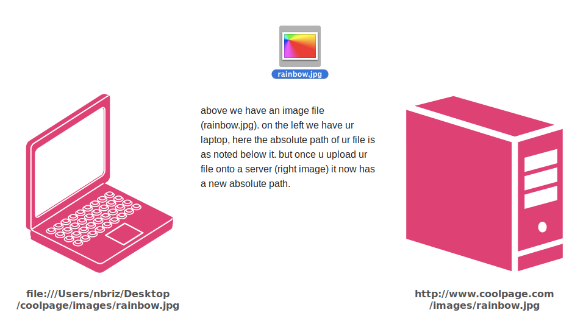
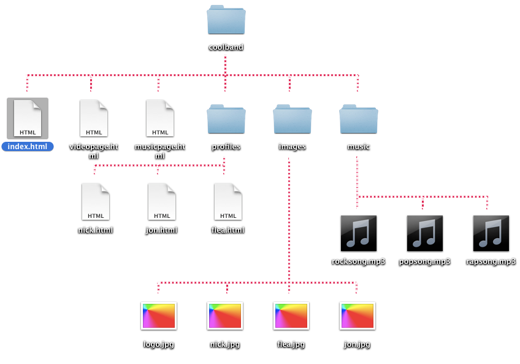

# File Paths

## What is a path?

```
folder/folder/file.html
```

a **path** is the unique location of a particular file (or folder). a path points to a specific file by following its "directory tree" (the folder within a folder within a folder etc.). there are two kinds of paths, the first is an **absolute path**, which lists the exact location of a file, starting from the root directory on that specific computer (phone, laptop, server, etc.) && ending with that file. the second way to write a path is known as a **relative path**, which describes the location of a particular file "relative" to (starting from) the folder we're currently in or the file we are writing the path in.

here's an example **absolute path**. absolute paths will work no matter what ur present working directory is (that's the folder ur terminal session is currently inside of)
```
/Users/nick/class-stuff/final/presentation.ppt
```

when a path starts with a `/` like above it essentially means we want to start at the top (or root) of the hard drive && work our way down the directory (folder) tree from there.

here's an example **relative path** to the same file. notice that there is no `/` at the start, we simply begin w/the name of a folder, this means start working our way down the directory tree given the file or folder we are currently inside of. assuming are present working directory is our home folder (in this case the "nick" folder), meaning we're currently in the "/Users/nick":
```
class-stuff/final/presentation.ppt
```

another way we could write the same relative path is to start w/this: `./` when writing paths, a `.` means "this folder" (ie. the folder u are currently inside of)
```
./class-stuff/final/presentation.ppt
```

now let's assume we're currently in the "/Users/nick/other-stuff" folder, which is to say we need to go back one (to setup out of the "other-stuff" folder) in before we can jump into the "final" folder, when we want to go back a directory we use the `../` for example:
```
../class-stuff/final/presentation.ppt
```

u can use `../` as many times as u need to in order to traverse the directory tree upwards, so say we're yet another folder deeper, like the "/Users/nick/other-stuff/pictures" folder:
```
../../class-stuff/final/presentation.ppt
```


## Using paths in terminal

say for example we have a folder (ie. a directory) called "my-stuff" which is located in the root directory (meaning it's located at the top of ur hard-drive, it's not inside any other sub-folders, just like the "Users" folder in the examples above) w/the following directory tree:

```
/my-stuff/
		├── docs/
		│   ├── diary/
		│   │   ├── day1.txt
		│   │   ├── day2.txt
		│   │   └── day3.txt
		│   │
		│   └── dont-open/
		│       └── passwords.txt
		│
		├── music/
		│   ├── cool-song.mp3
		│   ├── jam.mp3
		│   └── loop.mp3
		│
		└── pictures/
			├── cats/
			│   ├── cute-kitty.jpg
			│   ├── grumpy-cat.png
			│   └── lil-bub.jpg
			│
			└── dogs/
				├── doge.jpg
				└── puppies.gif
```

if we wanted to view the contents of "day1.txt" we could use the `cat` command to write the following **absolute path** like this `cat /my-stuff/docs/diary/day1.txt` when writing absolute paths in the terminal u must start the path w/a forward slash.

we could use the `cd` command to change our present working directory to the "docs" folder by navigating into it like this: `cd /my-stuff/docs`. at this point if we used the `ls` command to list the items in the current directory it would list these two folders: `diary dont-open`. from here we can `cat` the contents of day1.txt using a **relative path** in one of two ways, like this: `cat diary/day1.txt` or like this `cat ./diary/day1.txt` beginning the path with the name of a directory (which is inside our current working directory, in this case my-stuff) or with a `./` are both ways of specifying a relative path.

we could also navigate into the diary folder from here like `cd diary` && then cat the file like this: `cat day1.txt` or like this `cat ./day1.txt`, now that we are inside the "diary" folder.

if we want to cat the data inside the "doge.jpg" picture we can use the `../` to write relative paths to files that are up/back a few directories. assuming our present working directory is still the "diary" folder, we need to navigate back twice (once to go back from "diary" to "docs" then again to go back to "my-stuff") before we can reference the "dogs" folder, so we would write: `cat ../../pictures/dogs/doge.jpg`

if we want to change our present working directory to the "dogs" folder to write these as a simpler path we have to first do: `cd ../../pictures/dogs` to navigate from "diary" to the "dogs" folder. from here we can cat the data inside the "doge.jpg" file like: `cat doge.jpg`

## Writing paths in files

**absolute paths**


**relative paths**

when ur linking to pages or files in ur own website its better to use **relative paths** b/c the absolute path will change when u upload ur website (folder) from ur computer onto ur server (b/c ur computer will have a different directory tree than the server's computer). if all the files on ur site were in the same folder than all u need to create a relative path is the file name: **rainbow.jpg** if ur website has different sub folders, than ur relative path needs to tell the browser how to get from the page ur are currently on, && over to the file being referenced. example: **images/rainbow.jpg**



say for example we're on the index.html page above, to go from that "index.html" page to the "logo.jpg" file we would write a relative path like this: `images/logo.jpg`


say for example we're in the nick.html page, we now need to go up && out of the "profiles" folder before we can enter into the "images" folder. to do this we use `../` so a path from "nick.html" to "logo.jpg" would look like this: `../images/logo.jpg`
