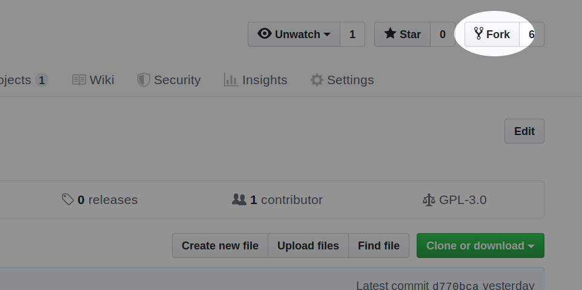
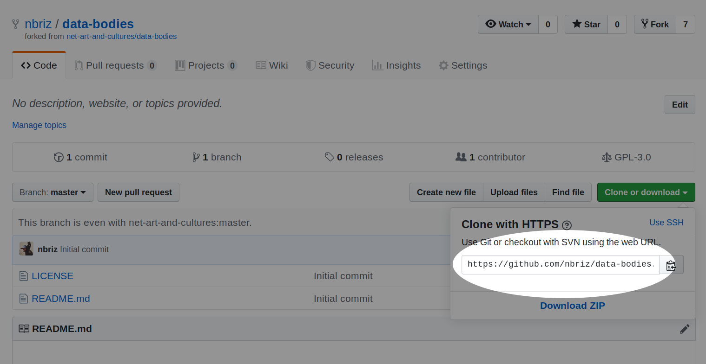
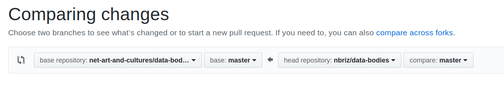

# Internet Artware Project

The following notes recap what we discussed in class on Nov 5 when we formed our two Artware groups, [the-tookit](https://github.com/net-art-and-cultures/the-toolkit) && [data-bodies](https://github.com/net-art-and-cultures/data-bodies) (which again, are temporary titles, i'm expecting both groups to rename their project before presenting what u have the final week of class). As we discussed in class our **goals for this final project** are as follows:

  - we've learned all the basics of programming in JavaScript (variables, loops, conditionals && functions) && have practiced these by creating small sketches using the p5.js library. w/this final project we want to practice using these core concepts to solve "real world"(ish) problems, which in this case are the various "tasks" we add to our "backlog" during the development of our Artware project.
  - solving these tasks will also require practicing our tech vocab. in class we've discussed how different browser APIs, libraries/frameworks && third party APIs/services can be built upon to create more complex projects, but finding these && reading their documentation will require practicing our vocabulary (to search for things, ask questions on forums like [stackoverflow](https://stackoverflow.com/) && to read/understand documentation, posts && tutorials).
  - lastly, we want to practice what it's like to work collaboratively on an [Open Source](https://en.wikipedia.org/wiki/Open_source) project using an [AGILE](https://en.wikipedia.org/wiki/Agile_software_development) development workflow.


## Getting Setup

Everyone created && cloned their forked repos during class, but in case u need to setup ur project again (maybe u're working on a different computer), here's a review of the setup process:

1. create a fork of ur group's repo by clicking the fork button on the upper right hand corner of the repo's GitHub page (make sure u are logged into ur GitHub account) 

2. once u've created the fork, copy the clone URL from ur fork of the repo:  then in ur terminal `cd` into the folder u want to clone (ie. download) ur forked repo into && run `git clone GIT-CLONE-URL` (except w/the url u copied from ur forked repo). **NOTE:** make sure u're using the URL from ur forked repo && not the class repo, notice how in the upper left hand corner of the screenshot above it says my username "nbriz", u should be cloning from ur forked repo (which has ur username).

3. lastly, in order to "fetch" any updates our collaborators have contributed to the class repo into our cloned repo we need to let our local git know about the original class repo. u'll need to `cd` into ur project folder (ie. `cd the-toolkit` or `cd data-bodies`) && then run `git remote add upstream CLASS-REPO-GIT-URL` replacing the URL w/ur project URL, which will either be  `git remote add upstream https://github.com/net-art-and-cultures/data-bodies.git` or  `git remote add upstream https://github.com/net-art-and-cultures/the-toolkit.git`.

if u want to make sure that u registered that last step correctly u can run `git remote -v` u should see 4 results, the first two "origin" URLs should point to ur forked repo while the last two "upstream" URLs should point to the class repo, so for example, the ouput for my cloned copy of the-toolkit repo looks like this:
```
origin	https://github.com/nbriz/the-toolkit.git (fetch)
origin	https://github.com/nbriz/the-toolkit.git (push)
upstream	https://github.com/net-art-and-cultures/the-toolkit.git (fetch)
upstream	https://github.com/net-art-and-cultures/the-toolkit.git (push)
```


## Working on Tasks

In class we created the initial tasks for both groups, but as u work on ur final these taks are likely to change, u might realize a task needs to be broken down into smaller tasks or u might notice that something new needs to be done && so u might create new tasks as u go along. The process for working on a task is as follows:

1. **Create the Task**: in the Issues tab of the class repo (not ur forked repo) u can create a task be clicking the "New Issue" button && then writing a title && description of that task. Then assign it the green "task" label by clicking the "Labels" dropdown on the right. Once u decide who is going to work on that task, assign urself to the task by clicking the "Assignees" dropdown on the right. If this task is something u plan on working on during this sprint, click the "Projects" dropdown to include the task in the To-Do list of the Sprint Board.

2. **Move the Task from To-Do to In-Progress**: once u're ready to start working on a task, visit the Sprint Board by clicking the Projects tab on the class repo (not ur forked repo) && choosing the current sprint. Assuming the task was added to this project, u should see it appear in the To Do list (the first column of the board), click && drag it onto the In Progress column so that ur collaborators know u've started working on it.

3. **Research**: search online && use the various sites we discussed in class (like [MDN](https://developer.mozilla.org/en-US/) && [stackoverflow](https://stackoverflow.com/)) to find solutions to the problem. remember, if at any point u feel lost or stuck, send me an email && i can help u find what u're looking for online +/or help explain anything u've found which seems confusing.

4. **Code**: once u've found what u need && have some idea for how to solve this particular task, start coding. don't forget to always have the browser console open while u work, there will be bugs! we'll be using more or less the same git workflow that u've been using all semester, except with one added step first:
  - everytime u sit down to work on a task, the first thing u should do is check to see if there is any new code to "fetch" && "pull" (ie. download) that one of ur collaborators may have contributed to the class repo. to do this open a terminal && `cd` into ur project && then run `git fetch upstream` to check for updates, && then `git merge upstream/master` to download those updates to ur local repo. once u're up to date, u can start working on ur own code.
  - as usual, use Atom (or the terminal) to: Add new/modified files to the stage, && then commit (w/a simple but clear message) changes as u make them.
  - when u're finished working (or before u take a break from working) make sure to update ur GitHub repo w/everything u've committed so far by clicking the "push" button (or running `git push origin master` in the terminal) to send all the new code up to GitHub.


5. **Submit a Pull Request**: once u've completed a task u can create a "pull request" by clicking on the "Pull Request" tab of ur forked GitHub repo && then pressing the green "New pull request" button, u should see something like this:  make sure that the repo on the right is ur forked repo && that the arrow is pointing at the class repo (on the left). Once u've created the pull request, visit the Sprint Board in the Projects tab of the class repo && move the task from To Do over to the Code Review column.

6. **Address Pull Request Feedback**: i will be reviewing everyone's pull requests (PR), no code will be "merged" (ie. incorporated into) the class repo until i've checked && approved it. i may leave feedback in the code review asking u to change or address things before i accept the PR. just like our p5 sketches, any commits u push to ur repo while the PR is still open will automatically update the PR. Once i've accepted the PR the cycle begins all over again, move ur next task from To Do to In Progress && begin again.
