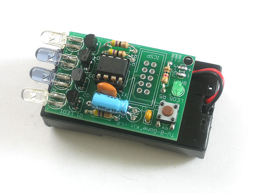
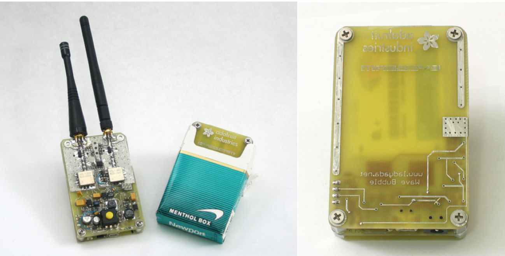
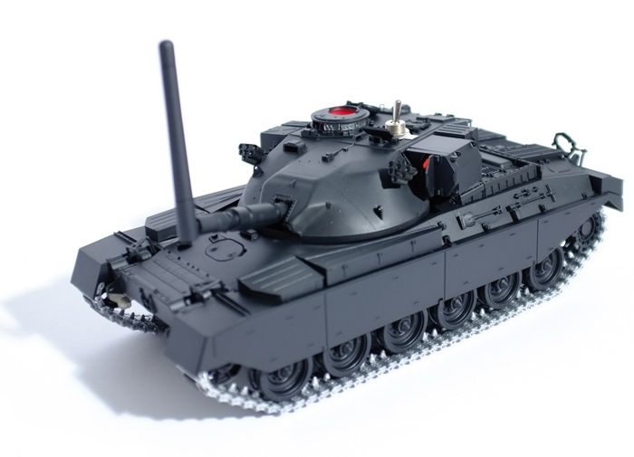
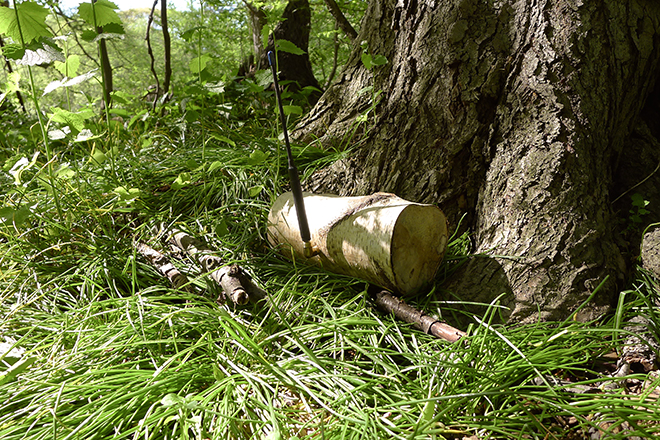

# hackers

### in contemporary culture

### in real life

### hacker artists

TV-B-Gone by Mitch Altman ~2004

Wave Bubble by Limor Fried (aka ladyada) ~2006

No Network by Julian Oliver ~2013

Log Jammer by Allison Burtch ~2014
