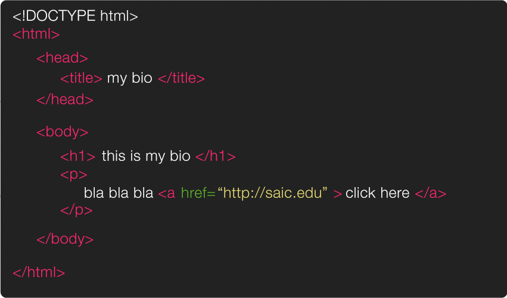

# Hypertext Markup Language (HTML)

HTML is a kind of markup language ([see markup notes](../markup/README.md)). we use **HTML elements** in order to give our HTML page structure + organize our content. an element usually consists of a pair of tags, an opening tag has a `<` followed by characters that specify which tag it is, && then a `>`. the closing tag is the same except with `/` before the characters. between the opening `<tag>` && the closing `</tag>` is where we place our content.


a list of all the HTML elements can be found [here](https://developer.mozilla.org/en-US/docs/Web/HTML/Element)

inside the opening tag (between the `<tag` && the `>`) u can include **attributes**. attributes are used to add extra information about that particular element. the first part of an attribute is the attribute name. it indicates what kind of extra information ur going to add to that element. these names are specific, always lower case && followed by a `=`. the second part of an attribute is the attribute value, this is the info or setting for this attribute, different elements can have different values, but they should always follow the `=` && be surrounded in `" "`.


a list of all the attributes (and their corresponding elements) can be found [here](https://www.w3.org/TR/REC-html40/index/attributes.html)

when we're ready to create a new HTML page there are a few basic tags && structure that we should always start with (this can be considered a basic HTML template)



first, the `<!DOCTYPE html>`, this is a declaration that tells ur browser that the code that follows conforms to the standards of a particular version of HTML, these used to be long && complicated (see previous [versions here](https://www.w3schools.com/tags/tag_doctype.asp) if you're curious) but with the latest version of HTML (HTML5) its short && sweet.

after that we've got our first official **element**, `<html>` the opening tag indicates that everything in between it && the closing `</html>` is going to be HTML code.

inside of the HTML element there are two major elements, the `<head>` ... `</head>` which contains information about the page, && the `<body>` ... `</body>` which contains everything that will show up inside the browser window.

the only thing we absolutely need inside of our head element is a `<title> Page Title </title>`. u won't see this inside ur browser window (b/c its not in the body) but will show up in lots of other places for example on ur browser tab, && also in google search results.

inside the body u include all of the elements that will create the structure of ur content, for example u can create headers with `<h1>` ... `</h1>` && smaller headers with `<h2>` ... `</h2>` && u can create paragraph containers w/` <p>` ... `</p>`.


## HTML Boilerplate

in computer code parlance "boiler plate" code is code snippets that show up again and again for a given situation. programmers usually copy+paste boiler plate code (or save as snippets in their code editor of choice) when they're getting started on a particular task rather than writing the same code over && over again. below is an example of a basic HTML boilerplate (w/comments so u know what each part does).


```html

<!DOCTYPE html>
<html>
  <head>
    <!-- this is the title of ur page -->
    <!-- it shows up in the browser tab, search results, etc. -->
    <title> My Page! </title>

    <!-- this meta tag tells the browser to use the unicode character set -->
    <!-- so u can use characters beyond the ones found in ur keyboard,  -->
    <!-- for ex: ñ, 悆 or ☺  -->
    <meta charset="utf-8" />

    <!-- this meta tag is a description of ur page -->
    <!-- it shows up in search results or when shared on social media -->
    <meta name="description" content="My cool website!">
    <!-- this one is for the author of the page -->
    <meta name="author" content="Nick Briz">

    <!-- this is so ur page looks good on mobile -->
    <!-- more details can be found in the CSS Layout notes -->
    <meta name="viewport" content="width=device-width, initial-scale=1">

    <!-- this is for the little icon that shows up in the browser tab -->
    <!-- this assumes u have a file called "favicon.ico" -->
    <link rel="icon" type="image/x-icon"  href="favicon.ico">

    <!-- it's standard to put ur CSS in a separate file -->
    <!-- this assumes u have a "styles.css" file in a "css" folder -->
    <link rel="stylesheet" href="css/styles.css">

  </head>
  <body>
    <!-- here in ur body u put whatever u want :) -->
    <!-- this is what folks will see in their browsers when they visit ur page -->
  </body>
</html>
```
