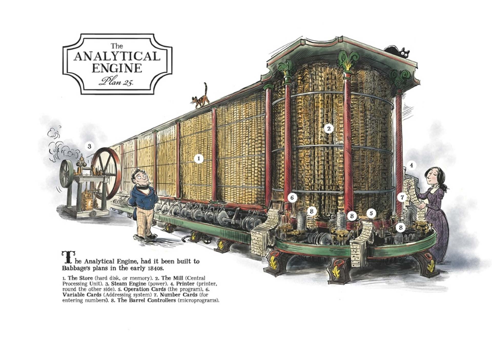
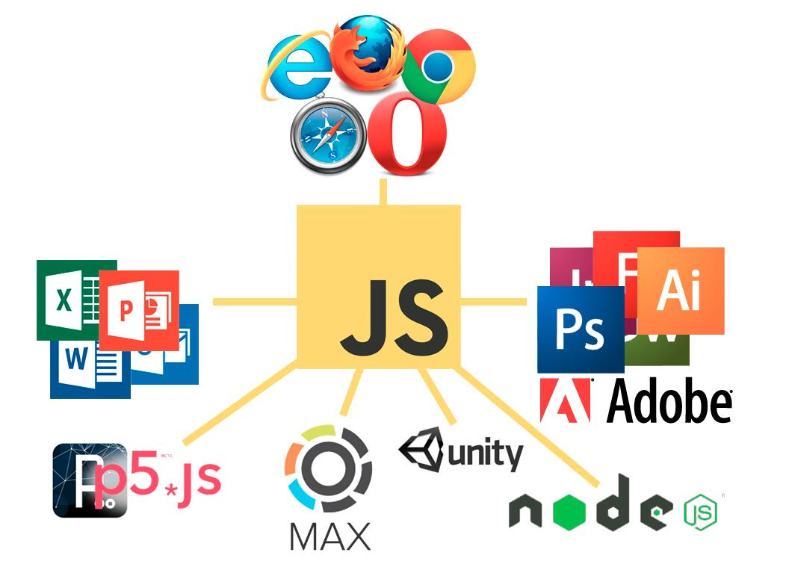
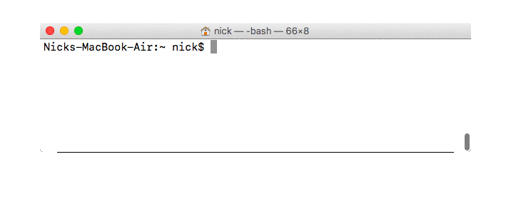
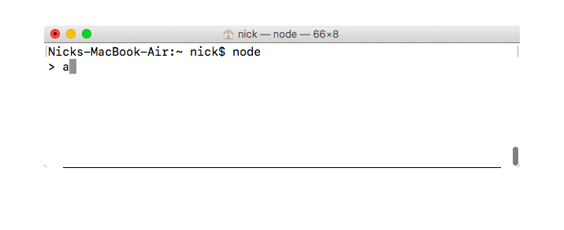
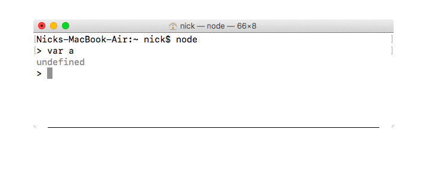
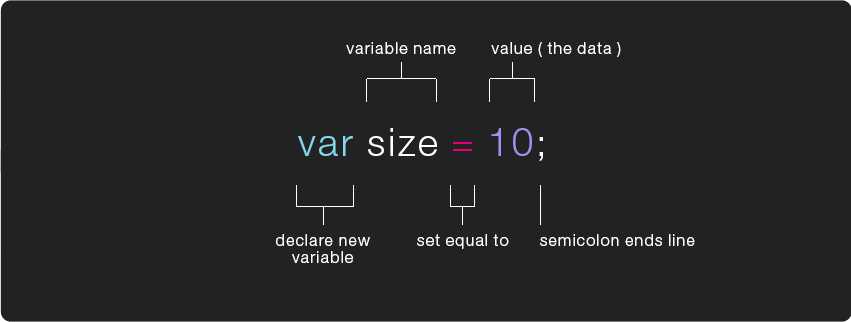
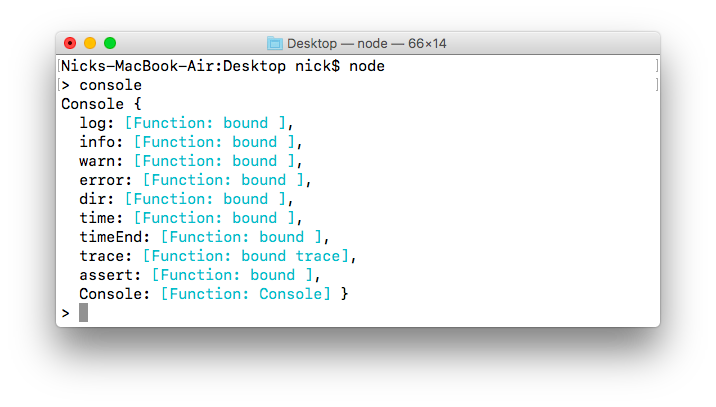

[](https://youtu.be/kgicuytCkoY)

# how to write ur first program

the first program everyone learns to make (regardless of the programming language u're learning) is how to print "hello world" onto ur screen, that's what we'll be learning to do today in JavaScript. this really only takes a few minutes to learn, but given the goals of this class we're going to take a much deeper dive into this very simple program than folks might normally take in this sort of introduction. "Programming, it turns out, is hard. The fundamental rules are typically simple and clear. But programs built on top of these rules tend to become complex [...] A computer is a machine built to act as a host for these immaterial machines [programs]. Computers themselves can do only stupidly straightforward things. The reason they are so useful is that they do these things at an incredibly high speed. A program can ingeniously combine an enormous number of these simple actions in order to do very complicated things" *(from Marijn Haverbeke's introduction to [Eloquent JavaScript](https://eloquentjavascript.net/), a Modern Introduction to Programming, 2015)*

> People imagine that programming is logical, a process like fixing a clock. Nothing could be further from the truth. [...] The problem with programming is not that the computer isn't logical --the computer is terribly logical, relentlessly literal-minded. Computers are supposed to be like brains, but in fact they are idiots because they take everything you say completely at face value. I can say to a toddler, "Are yew okay tewday?" But it's not possible for a programmer to say anything like that to a computer. There will be a syntax error ⸺ *Ellen Ullman, from "Out Of Time: Reflections on the Programming Life."*

# what's a computer?

[](https://youtu.be/O5nskjZ_GoI)

as it turns out, the first computers didn't even use electricity, there’s nothing inherent to the concept of a computer that requires electricity (it just so happens that electric current flows pretty fast, which makes it useful for doing things really fast). but in theory u could create a computer using gears && levers powered by steam, which is exactly what Charles Babbage designed in Victorian Era England, 100 years before the first electronic computers were made. in a sense Babbage was the first computer engineer && his Analytical Engine (had it been completed) the first computer, capable of doing all the key things, as proven/articulated by Ada Lovelace who, in her Notes of the Analytical Engine, described how the Engine could be used to calculate all kinds of things. she detailed the specific instructions necessary for “programming” the Engine, in a sense making her the first computer programmer.


*from '[The Thrilling Adventures of Lovelace and Babbage](http://sydneypadua.com/2dgoggles/)' by Sydney Padua*

> Again, it [the Analytical Engine] might act upon other things besides number, were objects found whose mutual fundamental relations could be expressed by those of the abstract science of operations, and which should be also susceptible of adaptations to the action of the operating notation and mechanism of the engine . . . Supposing, for instance, that the fundamental relations of pitched sounds in the science of harmony and of musical composition were susceptible of such expression and adaptations, the engine might compose elaborate and scientific pieces of music of any degree of complexity or extent.  ⸺ *Ada Lovelace, from her notes on the Analytical Engine*

so while u could build a steam power computer out of gears (or anything really like [dominoes](https://www.youtube.com/watch?v=OpLU__bhu2w) or even [blocks in minecraft](https://www.youtube.com/watch?v=1X21HQphy6I)) things got a lot more practical && faster when we replaced gears w/electro-mechanical relays + cables, && even faster when we replaced those relay switches w/vacuum-tube switches && even faster still when we replaced those w/transistors, all the while more or less the same basic idea, but each time smaller && more efficient:

[](https://youtu.be/LN0ucKNX0hc)

so computers are really just a very massive/complex arrangement of circuits, or small switches connected together that pass along electrical signals from one part of the circuit to another. we can arrange these circuits in ways that do arithmetic (in the [CPU](https://www.youtube.com/watch?v=xISG4nGTQYE)) or remember things (in [memory](https://www.youtube.com/watch?v=XETZoRYdtkw)) && in ways that can keep that current [flowing](https://www.youtube.com/watch?v=SmQ5K7UQPMM) incredibly fast.

while it's totally possible to build ur own computer (some folks do it [for fun](https://www.youtube.com/watch?v=HyznrdDSSGM)) as programmers we don't really have to worry about putting the circuits together we just focus on programming the computer, telling the computer what to do or telling the computer how the electricity should flow, that's programming.

# programming is like conceptual art

> The idea becomes a machine that makes the art ⸺ *Sol Lewitt*


what makes computers amazingly different from all the other machines that came before it is that it's "programmable". before computers machines were intrinsically tied to a specific function: a train was for moving stuff down a track, a camera was for taking photographs, a telegraph was for transmitting messages, these are very explicit mediums. a computer's purpose, however, depended on how u wired it up (or later, what u stored in it's memory) it is a "programmable" machine, it can become whatever u wanted it to be, a "[meta-medium](http://www.newmediareader.com/book_samples/nmr-26-kay.pdf)". while programming is a pretty refined craft at this point, at it's heart it's just about coming up w/different ways of leveraging the circuits in a computer, it's about coming up w/ideas that can be expressed in step by step "instructions." programs are concepts, though u can "save" or "store" a program in a memory stick or write it down on paper, the "file" itself isn't "the work" in the same way that the instructions written down on paper for Yoko Ono's instruction pieces wasn't "the work".


there's an established history of the [intertwingularity](https://en.wikipedia.org/wiki/Intertwingularity) between software && conceptual art. dating back to at least 1970 w/the show ["Software, Information Technology: Its New Meaning for Art"](http://www.fondation-langlois.org/html/e/page.php?NumPage=541) curated by Jack Burnham at the Jewish Museum in New York, && continuing to this day w/the work of artists like [Casey Reas](https://www.youtube.com/watch?v=_8DMEHxOLQE). ...but what do "instructions" look like for computers?

# speaking the computer's "language"

again, it's important to remember the computer is a very specific (&& complex) arrangement of circuits in such a way that makes it possible for it to remember values && manipulate values (do math), but how does electricity become "values"? that's where Machine Code (or binary code) enters the picture. that electrical current is made up of high voltages && low voltages which we refer to as a 1 or a 0 (binary code) for the sake of being able to use these voltages to represent values or data.

[](https://youtu.be/1GSjbWt0c9M)

so binary code can be used to represent ANY data we choose && we can give the computer data in binary code to operate on, in the old days we would do that by flipping switches (on/off 1/0) or storing our data in punched cards/tape (whole-punch/no-whole-punch 1/0) && having the computer read the tape. we can also pass instructions for what we want the computer to do w/the data, computers are designed to (think "wired up to") interpret certain sequences of binary code as instruction codes (like "add" this, or "store" that), && so early programs could look something like this:

[](step-through-program/1.md)

programmers rarely ever dealt w/binary code directly, we made things easier by writing "assembly code" which were slightly more human readable versions of this machine code (which we would translate into binary before running), here's the same program in a hypothetical assembly language:

```

		ORG 0
		LDA A
		ADD B
		STA C
		HLT
	A,	DEC 84
	B,	DEC 12
	C,	DEC 0
		END
```

it's rare u find folks working in assembly these days (though some folks do, check out the cool 8bit art of [Rachel Weil](https://www.austinchronicle.com/screens/2012-05-04/8-bit-artisan/) for example) b/c if it's that complicated to tell a computer to add 2 numbers together it be virtually impossible to make it do much more complicated tasks (generally speaking, Rachel might disagree). add to that the fact that u need to know the instruction codes && "architecture" (how the switches are wired up) for every CPU design if u wanted ur program to work on every computer (the only computer Rachel worries about is the NES) + u'd have to re-write ur code each time, essentially u'd have to be quite the expert to do even really simple things... enter Grace Hopper:

[](http://netart.rocks/videos/grace-hopper.mp4)

this code is an example of [FLOW-MATIC](https://en.wikipedia.org/wiki/FLOW-MATIC) the first "english-like" compiled language developed under Admiral Hopper, which would eventually lead to COBOL, which is still used today. it's an obsolete language, but this is as close as i can approximate what it would have looked like to add to numbers together, let's assume the values 84 && 12 are stored in file A && B. admiral Hopper also popularized the idea of machine-independent programming languages which is generally how we think of programming languages today.

```
INPUT FIRST FILE=A SECOND FILE=B,
	OUTPUT SUM FILE=C;
	ADD A TO B
	TRANSFER B TO SUM
	CLOSE-OUT FILE SUM
	STOP.
```

today we have lots of "higher level" (of **abstraction**) languages meant to be written && read by humans. different languages specialize in different contexts (for example JavaScript is ideal for programming apps for the web) && they all have different "**syntax**" but ultimately they can all do the same things (JavaScript could be used to write pretty much anything, not just web apps). in order to use a language on any given system (particular computer architecture) u need to make sure someone has written a **compiler** or **interpreter** for that language on that system so that ur code can get translated to the machine code the computer needs in order to actually run ur program. here are a few more example of the same simple program written in a few different languages, notice their general similarity despite their difference in syntax

```c
// C
#include <stdio.h>

void main(){
  int a = 84;
  int b = 12;
  int c = a + b;
  printf("%d\n", c);
}
```


```java
// Java
class myprogram
{
  public static void main(String args[])
  {
    int a = 84;
    int b = 12;
    int c = a + b;
    System.out.println(c);
  }
}
```

```JavaScript
// JavaScript (aka ECMAScript)
function main(){
  let a = 84
  let b = 12
  let c = a + b
  console.log(c)
}

main()
```

```python
# Python
def main():
  a = 84
  b = 12
  c = a + b
  print(c)

main()
```

```php
<?php # php
  function main()
  {
    $a = 84;
    $b = 12;
    $c = $a + $b;
    echo $c."\n";
  }

  main();
?>
```

```c
// C++
#include <iostream>
void main(){
{
  int a = 84;
  int b = 12;
  int c = a + b;
  std::cout << c;
}
```

# JavaScript

> [Netscape, 1995] displayed Web pages that were not very lively. You could have a nice cartoon of a monkey on the Web page, but there was no way to make the monkey dance when you moved over it with your mouse. Figuring out how to make that happen was the job of a language developer named Brendan Eich. He sat down and in a few weeks created a language called JavaScript [...] as browsers proliferated and the Web grew from a document-delivery platform into a software-delivery platform, JavaScript became, arguably, the most widely deployed language runtime in the world. If you wrote some JavaScript code, you could run it wherever the Web was—everywhere. ⸺ *Paul Ford, from [What Is Code](http://www.bloomberg.com/graphics/2015-paul-ford-what-is-code/) in Bloomberg Business (2015)*



as we've discussed computer programming languages are meant to be read by people, in order for computers to understand ur code (ur instructions) it needs to be translated into machine code that the computer understands. typically, this is done by running ur code through a **compiler** which will spit out a machine code version of ur file (the "source" code) that the computer can actually run (the app/program or "binary"). another way to do this is w/an **interpreter** or "runtime" which rather than converting ur source code into a separate machine code file, it will translate ur code for the computer right at the time u run ur file through the interpreter (ie. at "run-time"). all ur browsers && many other apps (like MaxMSP, Adobe apps like Photoshop, Unity && Microsoft Office) have a JavaScript runtime included in them, which is why u can use JavaScript on a website or in a Unity game.

node is somewhere in between a compiler && an interpreter, it's a JIT or "just-in-time" compiler, it will translate ur source code into machine code right when u pass ur source code to node. for more information on exactly how this works check out [A Crash Course in Just-In-Time Compilers](https://hacks.mozilla.org/2017/02/a-crash-course-in-just-in-time-jit-compilers/) by Lin Clark. *(though there are ways to "package" ur program as a "binary" (executable file) using things like [pkg](https://www.npmjs.com/package/pkg) for CLI apps or [electron](https://electron.atom.io/) for GUI apps)*

like most contemporary new-media projects node is perpetually being worked on && improved, which means there's been many different versions, we'll be using the most recent stable version v10.16.3 which u can download on the [nodejs](https://nodejs.org/en/) website.


# Using NodeJS

after u've installed node make sure everythings working by running `node -v` in ur terminal. if u see ur node version number print to the console then ur good! there's a couple of ways to get started from here, like most CLI apps u can run `man node` or `node -h` or `node --help` to learn more about it.

if u run `node` without any arguments it will open up a JavaScript shell, this is essentially an interactive JavaScript environment (it's sort of like being "inside" node) every line of JavaScript u enter (as in type-in + hit enter) will automatically get turned into machine code && executed by ur CPU then spat back (echoed) to the shell.



once in the shell type in a number to see the shell echo it back to u. this worked b/c numbers in JavaScript are an official **data-type** so the shell can return it back to u. next try writing something like `84 + 12`, this time it returns 96 b/c the `+` symbol in JavaScript is an "operator" which is used to load up that "ADD" instruction && return the result of that operation.

a fragment of code that produces a value is called an **expression**. we use operators in conjunction w/data to write expressions. below is a list of the most common operators && the kinds of expressions u might write w/them. for a full list of operators check out Mozilla’s[ expressions and operators](https://developer.mozilla.org/en-US/docs/Web/JavaScript/Guide/Expressions_and_Operators#Arithmetic_operators) page.

### arithmetic operators

**addition** `+`: used to add two numbers together (can be either floats or integers) `2.4 + 100` will return 102.4

**subtraction** `-`: used to subtract one value from another (can be either floats or integers) `48 - 7` will return 41

**multiplication** `*`: multiplication operator produces the product of two numbers (can be either floats or integers) where the left number is the multiplicand and the right number is the multiplier. `5 * 2` will return 10

**division** `/`: division operator produces the quotient of two numbers (can be either floats or integers) where the left number is the dividend and the right number is the divisor. `5 / 2` will return 2.5

**remainder (aka modulo or modulus)** `%`: returns the remainder left over when two numbers (can be either floats or integers) are divided `5 % 2` will return 1



now try inputting a letter, u should get an error like "a is not defined", this is because in JavaScript letters && words are used to store data into memory (like the binary code stored in different memory address in our earlier example) they are stand in for addresses in memory, but the letter 'a' hasn't been declared as a **variable** so we got that error, to declare 5 it type `let a` (or `let a` or `const a`, this [video](https://www.youtube.com/watch?v=sjyJBL5fkp8) explains their differences), now u the shell should return **undefined**, this is yet another data-type in JavaScript. anytime u have space allocated in memory w/out any data in it that variable is "undefined", meaning we haven't stored anything in the memory address the variable is pointing to. we can assign value to that variable by using the `=` assignment variable, try typing in `a = 84` && now the shell should return the value 84 back.

notice that b/c we already declared the a variable we didn't need to write "let" again (in fact that would throw an error), if u want to declare a new variable && assign a value to it u can do that all in one like `let b = 12`, u might notice something strange, this time the shell returned "undefined", that's because the **statement** "assign 12 to the variable b" doesn't return any value itself, it simply has the "side-effect" of storing a value in memory, if we want the shell to return it back we have to call that variable directly.



now we can do things like `let c = a + b` && if we call 'c' it'll return the value assigned to it (which is 96, the result of the operation). but we're trying to write Hello World, so we need to use a third data-type called **strings**. b/c letters && words are used for variable names in JavaScript, if we want to store letters && words as data we have to wrap them in either single quotes, double quotes or accent marks like this:
```js
"hi"
'hi'
`hi`
```

single quotes && double quotes do the same thing (just make sure u stay end the string w/the same symbol u started), accent marks are a little special but we'll come back to that another day. we can store any data-type in variables so we could also do `let greet = "Hello World!"` && return it by calling `greet` in our shell. notice this time we have a full word as a variable name, variables can be more or less any letter or word u want so long as it only contains letters numbers (though it can't start w/a number) dashes, dollar-signs && underscores, no other characters are allowed in variable names.

*(**NOTE:** technically it can’t be any name u think of, there are a few reserved words which mean special things in the JavaScript language, additionally depending on the environment/context u’re writing ur JavaScript in, there may also be additional pre-made/named variables u want to avoid conflicting with)*



though we've officially got "Hello World!" printing to the screen, we haven't actually "written" our Hello World program yet, b/c we've only been playing around inside node's JavaScript shell, in order to have a program, a series of instructions we can run whenever we want, we need to save our code to a file, which means save this data to our [file system](https://www.youtube.com/watch?v=KN8YgJnShPM) (in our hard-drive) so that we can call it back later (even when we restart our computer).

# hello world!

let's open up Atom (or any text/code editor u want) && write our first line of JavaScript. let's create a variable && store the string "Hello World" to it `let greeting = "Hello World!";`, this time i've added a semi-colon at the end of the line, statements in many "C-like" programming languages end w/semicolons (think of them as the periods at the end of a sentence), though in JavaScript these are usually optional. as we learned before, simply storing a value in memory doesn't "return" that value to us (the shell simply returned "undefined"), to return that value we need to call the variable, so let's add the variable name in the next line below our declaration. then we save the file in atom (which is how we tell the operating system that we want our program, the data that represents our instructions for the node runtime to execute, to get stored into the hard-drive for later reference). at this point our file should look like this:

```js
var greeting = "Hello World!";
gretting;
```

before we used the node command line program as an interactive shell, but we can also use it as a JIT (compiler/interpreter), meaning we can pass a file to it that we want converted to machine code && run. say for example u save the code above as "hello.js", u can run that code by doing `node hello.js` or even just `node hello` (w/out the ".js" b/c node assumes u're only ever gonna pass it a JavaScript file anyway).

if we run our program... nothing will happen. actually, something did happen, we stored our the string into memory && referenced it once before the program ended, but that all happened inside node (really inside our CPU/Memory) && never output (or showed us) anything. node took instructions in, but never sent anything out. the easiest way to get some output from a program is to print data to the terminal (u might recall 'standard out' from our [Command Line Lecture](../command-line/README.md)). for this we use a variable that's already been defined for us (part of the "standard library" of stuff we get right out of the box) called `console`. the console variable is already defined (so it's not undefined), but it doesn't have a number or a string stored in it, it has a fourth data-type we haven't mentioned: an **object**.

an object is a very special data-type in JavaScript (in many ways everything in JavaScript is an object... but we'll come back to that later on this semester). an object is like a 'meta' data-type, sometimes called a "data-structure", it's got other data inside of it. these other bits of data can be undefined or numbers or strings or even other objects. the way we access this sub-data (called a **property**, essentially variables inside objects) is by using a `.` symbol. for example, if we had an object called "nick" w/a property called "age" we can call that value up by doing `nick.age` which would return the value stored in the "age" property of the "nick" object. nick might have many different properties stored in it, like maybe `nick.favoriteColor` which might return the string "blue-green" or `nick.beardLength` which might return the number 0.1, etc. to see the properties stored inside the console object lets enter our node JS shell again && type in "console" to see what it returns:



u'll see lots of property names with the "data-type" listed to the right of it. in this case they all say "function" a **function** is yet another data-type in javascript. functions are ways of organizing tiny programs inside ur programs that u can call at different points in ur program, it's a way of making ur code more modular (a key concept in programming). we'll be talking a lot more about functions in later classes, but for now what u need to know about functions is:

- like all variables, functions have a name which follows the same rules as all variable names (letters, numbers, no spaces, etc.)
- instead of storing simple data-types in memory what they have is other instructions stored in them, ie. lines of code
- if u call the variable name of the function in the shell, like `print` it'll simply return the fact that it's a function. in order to run this mini program (those lines of code inside the function) u have call it with `()` symbols after it like `print()`
- those parenthesis are used to pass arguments to the function (think about the way we pass arguments to a command in the terminal) but some functions don't require arguments, in this case u leave it empty

in the JS runtime built into most browsers there's a built in function called 'alert', which takes some data (usually a string) as a single argument, for example `alert("poop")`, when u run that in a browser it creates a pop up window with the message "poop" inside it. the properties in the console object are all functions (when an object's properties are functions we'll refer to them as **methods** instead of properties). the console's log method is very similar to the browser's built in alert function, except rather than putting a message in a pop-up window it will send the data u pass it to ur program's "standard out", meaning it will get printed to the terminal. let's go back to our program && replace the second line with this new object, passing our 'greeting' variable as the argument to the log method.

```js
var greeting = "Hello World!";
console.log(greeting);
```

now if we run our program we should see the message print to the terminal (aka the console)! yay! we've completed our hello world program in JavaScript!!! one final thing to note about the console.log method is that it can take as many arguments as u want, meaning u can print the value of multiple variables if u want. when a function is capable of taking more than one argument u have to separate them with commas (unlike command line arguments which are simply separated by spaces), for example: `console.log(a, b, c)` will print the values of all three variables to the terminal.

### 6 types of data

one last thing to mention, at this point we've covered 5 different data-types u can use && store in variables in JavaScript **undefined** (ie. no-data), **number**, **string**, **function** && **object** (which is the most meta of them all, as it can store all the above inside itself as it's properties/methods). there's a sixth && final data-type, probably the simplest of them all, which we haven't covered: **boolean** a boolean can only be in 1 of 2 states, `true` or `false` nothing else. it's fundamental to the logic of computers (as u might imagine) && is something we'll talk about at length next time.

there are a couple of special objects which are often discussed as their own "type", but technically they're just objects, the first is arrays, which is a list of values, like object's in general, it's a structured of organizing related pieces of data. the second is null, which is similar to undefined in that it means "nothing", but where undefined can literally mean u declared a variable w/no value, null is when u deliberately invalidate it, like saying "this variable should be nothing right now." when we say `let x` by default x is 'undefined', but u could also do `let x = undefined` (which is the same thing), that's also how u change a variable to null, by assigning it as a value `let x = null`, that's it.

in many other programming languages u have to specify what data-type u are planning on storing in any given variable when u declare the variable, what this looks like is rather than having a general var keyword for declaring variables, the syntax is more specific such that he keyword articulates the type, for example to create an boolean value in some langauges u do bool `x = false` && a string would be string `x = "hey"`. JavaScript is a loosely typed or dynamic typed langauge (meaning the same variable can be/become any type). b/c of this it could get confusing when u're dealing w/variables for which u need to know the type ahead of time (can't be doing `x / 2` if x is a string, am i right?). for this reason there's a special unary operator called `typeof` which will return the type of any variable u put next to it, for example `typeof x` might return `"string"` or it might return `"boolean"` depending on what x is. this will come in handy later on when we start writing conditional statements && start creating functions which take arguments. to read all about data-types visit MDN's page on JavaScript types

> Although digital computers were originally designed to do arithmetic computation, the ability to simulate the details of any descriptive model means that the computer, viewed as a medium itself, can be all other media if the embedding and viewing methods are sufficiently well provided. Moreover, this new “metamedium” is active—it can respond to queries and experiments—so that the message may involve the learner in a two-way conversation. [...] We think the implications are vast and compelling [...] a new kind of medium would have been created: a metamedium, whose content would be a wide range of already-existing and not-yet-invented media. ⸺ *Alan Kay && Adele Goldberg from "[Personal Dynamic Computer](http://www.newmediareader.com/book_samples/nmr-26-kay.pdf)" (1977), inventors of SMALLTALK (at XEROX PARC) which led to all the graphical user interfaces we know + love today*
