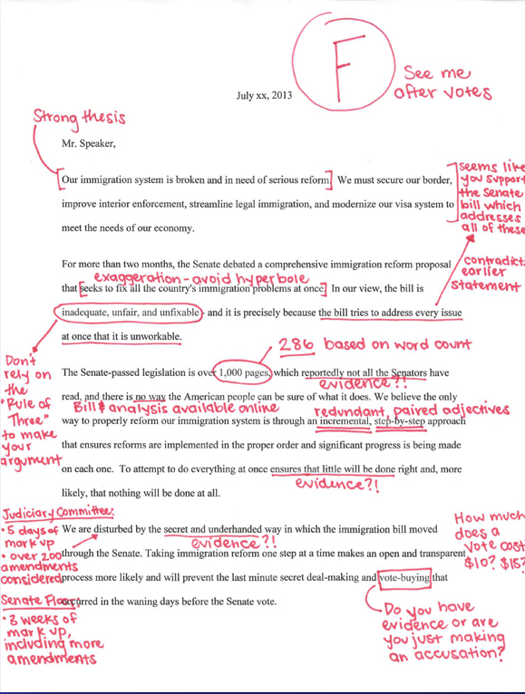
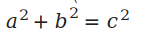
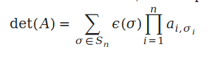
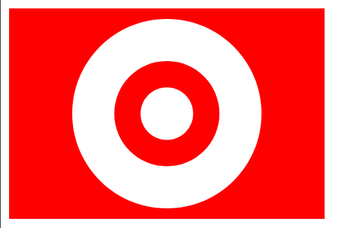

# what is markup code

in the world of computer code there are lots of different kinds of languages. at the root we could divide them into two large categories machine code: code that computers understand (usually represented as binary or hex) which isn't impossible but very difficult for humans to work w/ && then there's human languages, designed specifically for people (including artists && developers). this includes programming languages but also markup languages and style languages.

a markup language is a means of annotating a document w/designated symbols in a way that is distinguishable from the content of that document. the term comes from the non-computer world, some of u might remember ur middle school teachers “marking up” ur school reports in red pen. in this analogy, the content of the report was the stuff u wrote, while ur teacher's annotations (or comments about ur report) would be special symbols “marked-up” in red pen. In the same way that a teacher's red marks would explain to u what u did right/wrong in ur report, a markup language is a way of marking up a document to explain something to the computer about the content of that document.



Say we have the following document:

```html
Google googlers google Google.
```

this is an intentionally confusing sentence at first glance, but we can clear things up by annotating this sentence with made-up markup code like this:

```html
<adjective>Google</adjective> <noun>googlers</noun> <verb>google</verb> <noun>Google</noun>.
```

the red words surrounded by less-than `<` && greater-than `>` symbols are called “**tags**”, the tag to the left of a particular piece of content is called the **opening tag** && the one to the right is called the **closing tag**. the two are almost identical except for one important piece of syntax, the forward-slash symbol `/`, that's how u can tell which is the opening-tag && which is the closing-tag . the name of the tag pair says something about the content between them, in this case it tells us their parts of speech. the first “Google” is an adjective while “googlers” is a noun (so now we know we're talking about googlers [people who google] who work at Google), the third “google” is a verb (as in to search for something on google) while the last “Google” is a proper noun, the company “Google”. so now thnx to the mark-up we understand what the sentence means, googlers who work at Google are google-searching their company's name “Google”... Google googlers google Google

in markup u can also put tag pairs between other tag pairs like this.

```html
<subject><adjective>Google</adjective><noun>googlers</noun></subject><predicate> <verb>google</verb> <noun>Google</noun>.</predicate>
```

now, this can start to get confusing as it becomes difficult to figure out which one is inside of which other one, so it can help to use indentations (w/the spacebar or tab key) && carriage returns (w/the return or enter key) to make this a bit clearer:

```html
  <subject>
    <adjective>Google</adjective>
    <noun>googlers</noun>
  </subject>
  <predicate>
    <verb>google</verb>
    <noun>Google</noun>.
  </predicate>
```

this doesn't effect the actual code though, u can put as many indentations && carriage returns (aka line breaks) as u want, it's all the same technically speaking -- this is just to make the code more readable for humans (it's easier to see which tags are in which other tags). so the most important thing here, is that u should adopt a style spacing style that's clear to u.

# what makes this code?

so what makes this “code” rather than just a normal text or word document? tbh, there not so dissimilar, it comes down to a couple of things...

first, the extension u give this file when u save it. if i save this as a `.txt` file then this is a text file, if i save this as an `.html` file then i have an HTML document (see the [HTML Review notes](../html/README.md) for more on HTML). try saving the code above in files w/different file extensions, u'll notice that ur computer automatically changes the file's icon. the extension clues the computer into what kind of file u want this to be && thus whether the data should be opened && interpreted by a text application or by a browser or some other program.

second, when a particular application opens the file && interprets the data that’s where things come to life. every file on ur computer just represents a collection of binary code stored on ur hardrive, in our case the `.txt` version of this file && the `.html` version have exactly the same binary code, so what makes the txt file a text document && the html file a code document? that’s a matter of the application we use to interpret that data, TextEdit interprets this as text and Firefox interprets this as code. similarly the applications are often just sets of instructions for how to interpret differently formatted files.

the art u make on a computer will usually exist somewhere between these two points: the file that stores ur data && a piece of software meant to interpret that data. in the case of net art, usually u’ll be writing html, css && JavaScript files that u’ll store on a computer (server) && ur audience will be viewing those files through their browser (client). the actual art is neither the files u write nor the browser the audience uses, it’s the combo of both, which is brought to u by the Internet. so is the file we wrote above text or code? well, that really just depends on the program we use to open it.

# Markup Languages

### Math ML

the most common type of markup language for us in this class is [HTML](../html/README.md), but it isn’t the only markup language. there’s [MathML](https://developer.mozilla.org/en-US/docs/Web/MathML) which as you might imagine is for representing mathematical expressions:

```HTML
<math>
  <mrow>
    <msup>
      <mi> a </mi>
      <mn>2</mn>
    </msup>
    <mo> + </mo>
    <msup>
      <mi> b </mi>
      <mn>2</mn>
    </msup>
    <mo> = </mo>
    <msup>
      <mi> c </mi>
      <mn>2</mn>
    </msup>
  </mrow>
</math>
```

the MathML code above when viewed through an application (including most browsers) that can properly interpret MathML will become this:




the pythagorean therum above is a relatively simple example, but much more complicated mathematical expressions can be written in MathML, for example:



### SVG (scalable vector graphics)

there's also [SVG](https://developer.mozilla.org/en-US/docs/Web/SVG) (which stands for Scalable Vector Graphics) for representing graphics, just like the kind you’d make in a program like Adobe Illustrator or InkScape. These are fundamentally different from non-scalable or "raster" images (like JPG, PNG, GIF, etc) which ultimately all boil town to a finite grid (aka matrix) of pixel color values (like the kind u'd create in Photoshop). vector image files, like SVGs, don't contain any raw pixel data, instead they contain information (like coordinates) the computer needs in order to create the image. && they store this information in the form of a markup, for example:

```HTML
<svg>
  <rect x="10" y="10" height="100" width="100" stroke-width="10" style="stroke:#00ccff;"/>
  <circle cx="60" cy="60" r="25" style="fill:#00ccff;"></circle>
</svg>
```

when saved as a `.svg` && viewed in Illustrator, InkScape or a web browser becomes:


&& this...

```HTML
<svg width="300" height="200">
  <rect width="100%" height="100%" fill="red" />
  <circle cx="150" cy="100" r="90" fill="white" />
  <circle cx="150" cy="100" r="50" fill="red" />
  <circle cx="150" cy="100" r="25" fill="white" />
</svg>
```

becomes this...



### GML (graffiti markup language)

there’s even artist made markup languages like GML or [Graffiti Markup Language](http://www.graffitimarkuplanguage.com/category/projects/) which is used as the backbone of a boatload of amazing new-media art projects by lots of different artists.


### markdown

while mose markup languages use this `<` tag `>` syntax to "markup" (ie. format) the contents of a document a particular way, there's a markup langauge called **markdown** which looks a little different. it has it's own syntax for formatting documents which looks like this:

```md
# This is a large heading
## this is a smaller heading
### even smaller

This is **bold** text, and this is **italicized** text. This is how you make a [hyperlink](https://en.wikipedia.org/wiki/Hyperlink) and ths is an example of a bit of `code`


```

markdown will be important for us, b/c this is the type of code that most programmers use to create documenation about their projects, everytime u see a doc on a github project it's usually written in markdown (including these notes! check out the [raw code version here](https://raw.githubusercontent.com/net-art-and-cultures/syllabus-and-notes/blob/master/notes/markup/README.md) for example.)

Check out GitHub's [Markdown Cheatsheet](https://github.com/adam-p/markdown-here/wiki/Markdown-Cheatsheet) for more info and syntax.
