# What is the Internet?

> Internet \in"ter*net\, n. A deeply misunderstood technology upon which we increasingly depend

[Julian Oliver & Danja Vasiliev](https://www.youtube.com/watch?v=v8IlNpefM6s)

> The Internet is the great masterpiece of human civilization. As an artifact it challenges the pyramid, the aqueduct, the highway, the novel, the newspaper, the nation-state, the Magna Carta, Easter Island, Stonehenge, agriculture, the feature film, the automobile, the telephone, the telegraph, the television, the Chanel suit, the airplane, the pencil, the book, the printing press, the radio, the realist painting, the abstract painting, the Pill, the washing machine, the skyscraper, the elevator, and cooked meat. As an idea it rivals monotheism

Virginia Heffernan (from her book [Magic and Loss: The Internet as Art](https://www.nytimes.com/2016/06/12/books/review/virginia-heffernans-magic-and-loss.html). Simon & Schuster. 2016.)

## networking demo

code for running a python server.
Open a terminal an navigate to the folder you want to serve:
```bash
cd path/to/folder
```
Then depending on which version of python you have installed, launch the server. For python 2:
```bash
python -m SimpleHTTPServer
```
and for python 3:
```bash
python -m http.server
```
if you don't know what version of python you have installed you can check first by running:
```bash
python --version
```

Now (assuming you've got the proper Sharing Settings set on your computer) another computer on the same network as you can request files from you using your local IP address. Your local IP address is listed in the Sharing section of your Settings, but you can also find it using the terminal. Enter `ifconfig` into your terminal (press enter) and look for the IP address next to the "inet" section of your WiFi card (which will show up in the outputed list)

Let's assume for deomonstration that your local IP address is 192.168.0.10, the other computer on the same network can now request data from your computer using the `curl` command in the terminal, for example:
```bash
curl http://192.168.0.10:8000/path/to/file.txt
```
or simply type that same URL into the address bar of a browser.

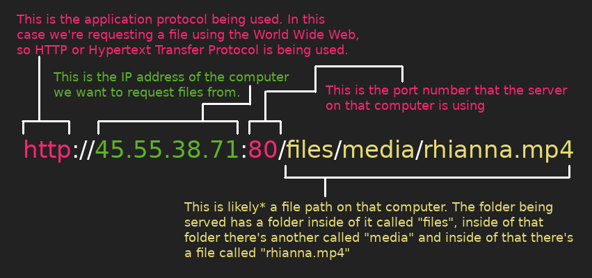

URL (Universal Resource Locator)

### DNS (the Internet's address book)

[](https://youtu.be/2ZUxoi7YNgs?t=1272)

[The Root Servers](https://www.iana.org/domains/root/servers)


## a brief history of the Internet

[](https://youtu.be/21eFwbb48sE)

### [1:10](https://youtu.be/21eFwbb48sE?t=70) "...a communication network that would survive nuclear war."

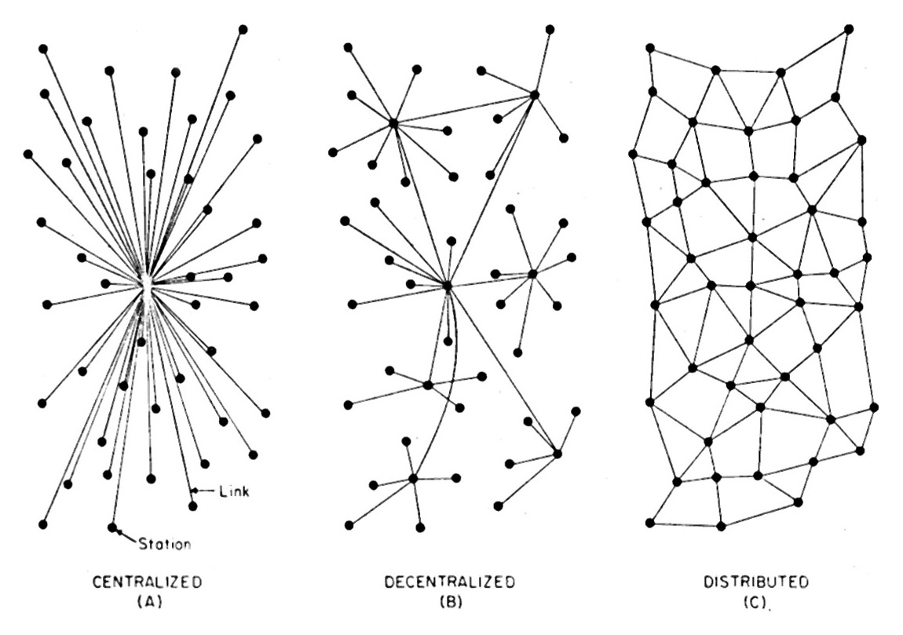

>  "The older telephone engineers had problems with the concept of packet switching. On one of my several trips to AT&T Headquarters at 195 Broadway in New York City I tried to explain packet switching to a senior telephone company executive. In mid sentence he interrupted me, “Wait a minute, son. “Are you trying to tell me that you open the switch before the signal is transmitted all the way across the country?” I said, “Yes sir, that’s right.” The old analog engineer looked stunned. He looked at his colleagues in the room while his eyeballs rolled up sending a signal of his utter disbelief. He paused for a while, and then said, “Son, here’s how a telephone works….” And then he went on with a patronizing explanation of how a carbon button telephone worked. It was a conceptual impasse."

from Paul Baran's [Oral History](https://ethw.org/Oral-History:Paul_Baran)

> “I found myself [at MIT] surrounded by computers and I realized that sooner or later, these computers would need to communicate with each other. I also realized that the existing telephone network was woefully inadequate for such communication [...] what was needed was a new network technology.”

Leonard Kleinrock (from an email exchange i had w/him)

[](https://youtu.be/yU9oMOcRsuE?t=1272)

### [1:19](https://youtu.be/21eFwbb48sE?t=79)"...time sharing..."

[](https://youtu.be/GjZ7ktIlSM0?t=1272)

> life will be happier for the on-line individual because the people with whom one interacts most strongly will be selected more by commonality of interests and goals than by accidents of proximity

from their pretty forward thinking 1968 paper [The Computer as a Communication Device](http://citeseerx.ist.psu.edu/viewdoc/download?doi=10.1.1.418.6996&rep=rep1&type=pdf). Science and Technology. 1968


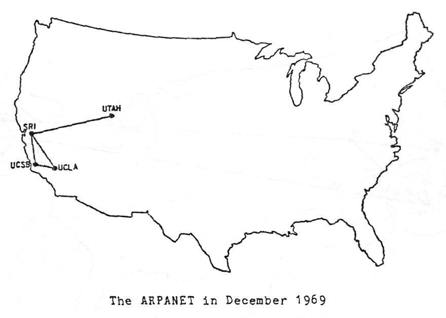

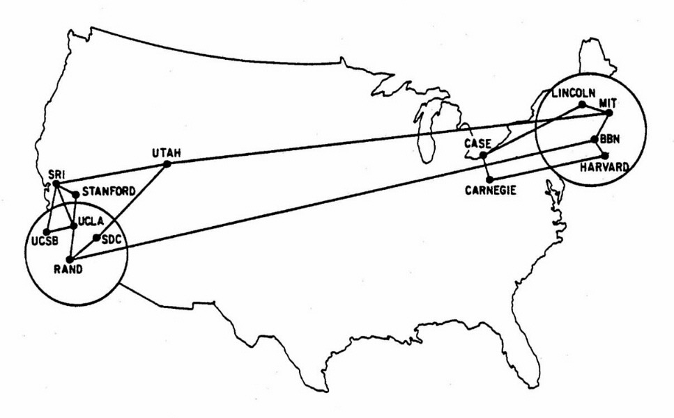

ARPANET 1970


### [2:12](https://youtu.be/21eFwbb48sE?t=132)"...packet switching."


### [2:58](https://youtu.be/21eFwbb48sE?t=178) "different networks can't talk to each other. TCP/IP solves this problem..."

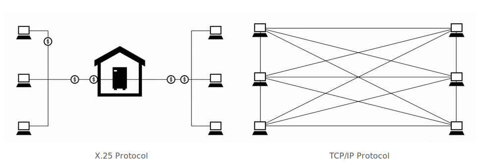

> Keep in mind that the original developers of the host level protocols were mostly graduate students. We adopted a humble and inclusive posture and a mantra that Dave Clark ultimately coined as ‘rough consensus and running code’ - which means we don’t really vote exactly, we just try to assess rough consensus among the group trying to agree on proposed standards.

Vint Cerf

> Closely related to keeping the technical design open was keeping the social process around the design open as well. Anyone was welcome to join the party

Steve Croker

(both above quotes from from [A History of the Internet and the Digital Future](https://www.press.uchicago.edu/ucp/books/book/distributed/H/bo10546731.html), by Johnny Ryan. Reaktion Books. 2010)

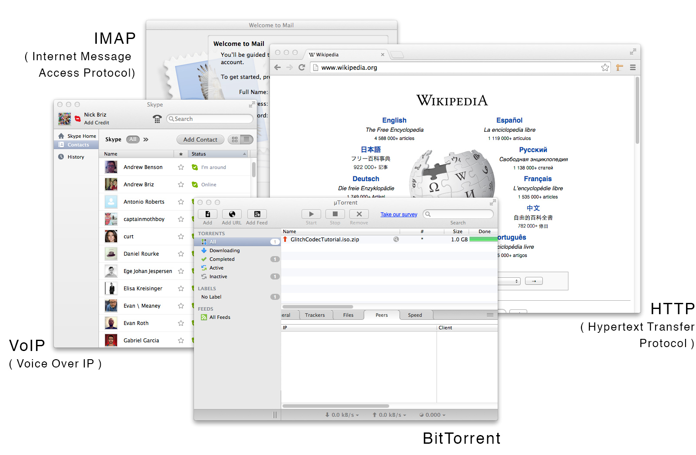

### [3:32](https://youtu.be/21eFwbb48sE?t=212) "...email ..."

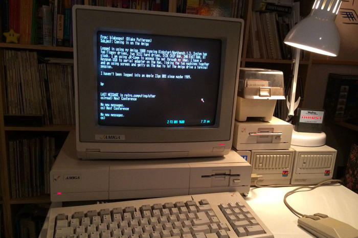

email in the 1980s

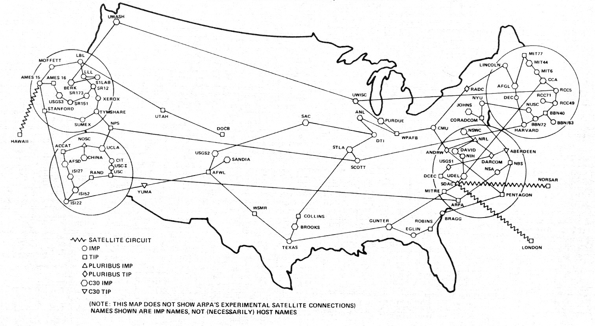

ARPANET 1982

[](https://youtu.be/h7guR5ei30Y)

[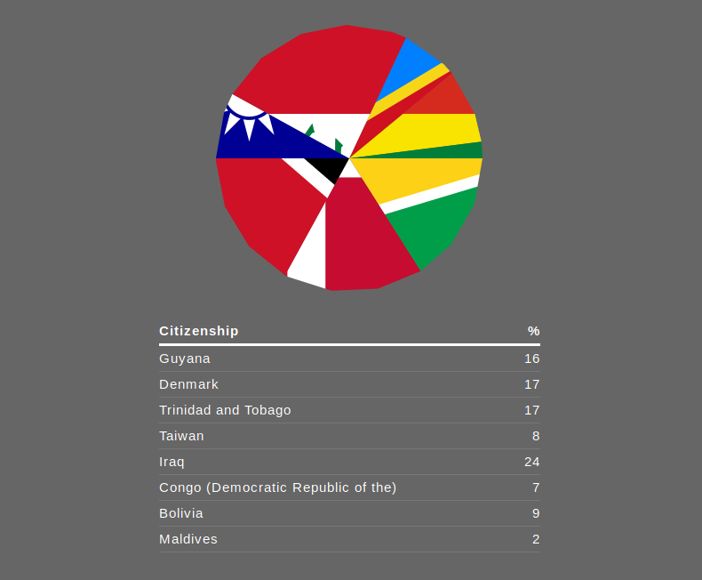](http://citizen-ex.com/)

### [3:56](https://youtu.be/21eFwbb48sE?t=236) the World Wide Web

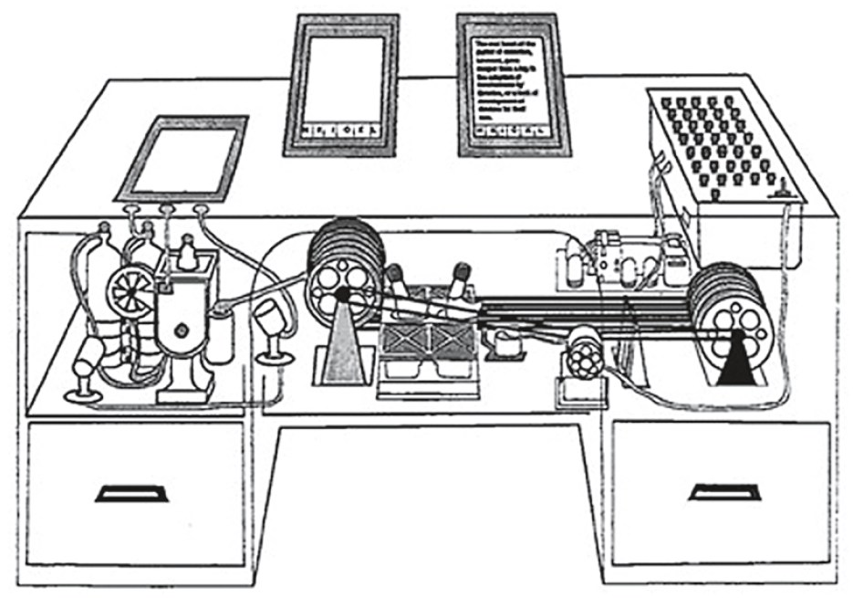
"the Memex" as described by Vannevar Bush in a 1945 issue of the Atlantic, in an influential article called [As We May Think](https://www.theatlantic.com/magazine/archive/1945/07/as-we-may-think/303881/)

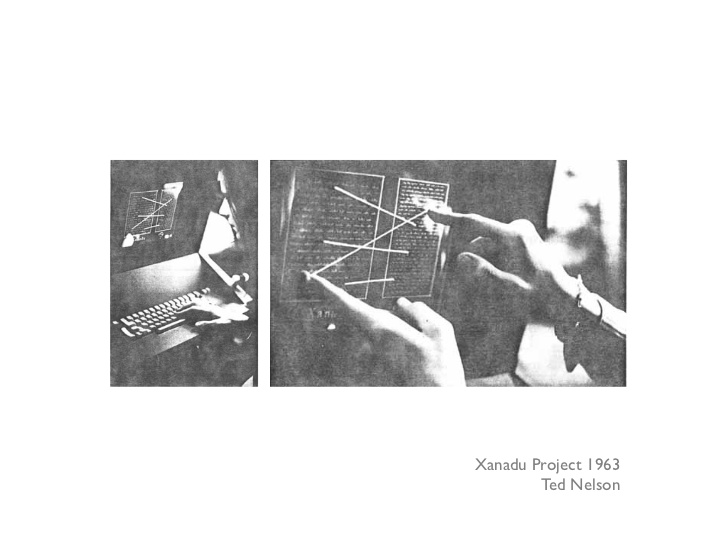

[](https://youtu.be/En_2T7KH6RA)

In 1989 Tim Berners-Lee wrote a proposal for a system for linking hypertext documents over the Internet. He submitted it to his boss at CERN (the research institute he was working at), who wrote in a memo, “vague, but interesting.” Despite the lack of support Berners-Lee went ahead and created HTTP (Hypertext Transfer Protocol) and the first application which could read documents formatted with HTML (Hypertext Markup Language). CERN still wasn’t interested, so he posted it to a few Internet newsgroups for free ...the rest was history, the World Wide Web was born.

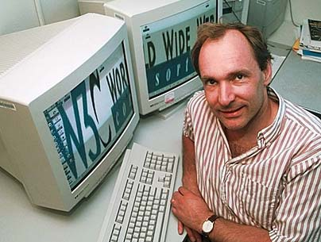

Afraid that the growing popularity of the Web might lead to corporate competition creating proprietary (non-open) web applications that would destroy the integrity and open nature of the Web, Berners-Lee held the first WWW conference to discuss open web standards. This lead to the creation of the World Wide Web Consortium ([W3C](http://www.w3.org/)) which he still directs to this day. The W3C is an international organization open to anyone (and made up of [governments, companies, not-for-profits, universities, etc.](http://www.w3.org/Consortium/Member/List)) and is in charge of developing the open standards for the web.

### [5:01](https://youtu.be/21eFwbb48sE?t=301) "...Al Gore..."

With the standardization of TCP/IP came the real possibility to connect the ARPANET with other international networks and create a “network of networks” each controlled by different organizations but all following the same rules/protocols to form the Internet. In the 80’s the military handed over the ARPANET to the National Science Foundation (NSF), who then built the first “Internet backbone”, a high-speed network that connected different parts of the Internet together.

Former US vice-president Al Gore may had [misspoken](https://www.youtube.com/watch?v=BnFJ8cHAlco) when he said he “took the initiative in creating the Internet” but what he was referring to was the work he and the Clinton Administration did to expand Internet usage beyond the academic niche. He wrote essays on the subject including “[Infrastructure for a Global Village](https://www.scientificamerican.com/magazine/sa/1991/09-01/#article-infrastructure-for-the-global-villa)” and pushed granting initiatives that lead to the National Information Infrastructure and the first popular graphical web browser (Mosaic). In 1994 the commercial restrictions were lifted when the Clinton Administration privatized the backbone. Around the same time Tim Berners-Lee's "web" project was really starting to get popular, and with that everyone started going "online."

Today, no single institution controls the Internet. There are thousands of commercial companies, non-for profits, universities, governments, public interest groups and other entities who play different roles in controlling and maintaining the Internet. The many backbones (or [Tier 1 networks](http://en.wikipedia.org/wiki/Tier_1_network#List_of_tier_1_networks)) are maintained by different companies and interconnect to each other to exchange traffic (at [Internet exchange points](http://www.internetexchangemap.com/#/), the Internet's many "centers") on a voluntary (surprisingly informal) basis. There are a handful of international not-for-profit organizations like the IETF ([Internet Engineering Task Force](http://www.ietf.org/)) and ICANN ([Internet Corporation for Assigned Names and Numbers](https://www.icann.org/)) which develop and maintain the Internet’s standards and conventions, many of which are open for anyone to join and participate in.


### tracing our packet's route

1. visit a website in your browser, right-mouse click the page and "View Source." This is the HTML code, the file itself, that just traveled the world to reach your computer.

2. In your terminal, type: `nslookup thewebsite.com`
to find the IP address of the server the website you visited is "hosted" on (replace "thewebsite.com" with your website). Your browser handles this lookup for you, first by asking your ISP and if they don't know the request get's passed along to one of these [Root Domain Server](http://root-servers.org/).


4. Sites like [whatismyipaddress.com/ip-lookup](https://whatismyipaddress.com/ip-lookup) && [ip2location.com](http://www.ip2location.com/demo) can tell u where that server is physically located

5. In your terminal, type: `traceroute somewebsite.com` or `mtr somewebsite.com` (if you have mtr installed) to follow the path that file took to get from here to there. It takes less than a second (only milliseconds) to "hop" through dozens of computers around the world.

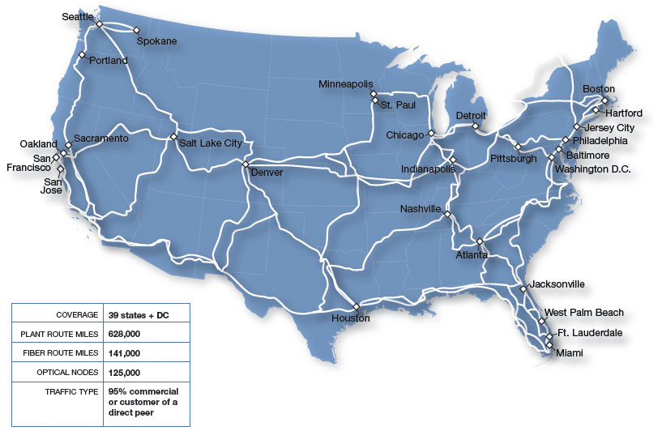
 Comcast's fiber network across the country

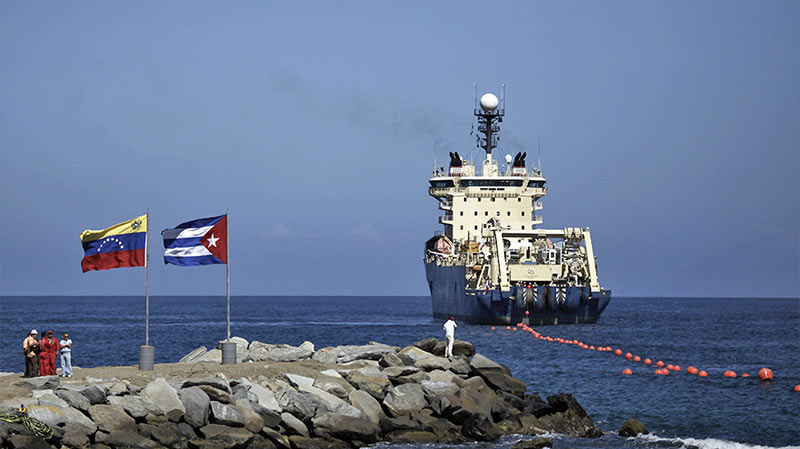

[this undersea cable its on its way to Cuba from Venezuela](http://runrun.es/runrunes/23374/la-corrupcion-cubana-en-empresas-bajo-las-ordenes-de-ramiro-valdes-salpicaria-a-venezuela-y-su-cable-de-fibra-a-cuba.html)

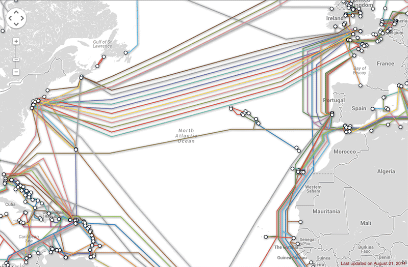
[view interactive undersea cable map](http://www.submarinecablemap.com/)
[view interactive network exchange points map](http://www.internetexchangemap.com/#/)


["This modest indentation on the Canadian coastline is a major Internet landmark, a sort of Ellis Island of the Web: It’s where a submarine cable owned by Hibernia Atlantic comes ashore."](http://andrewblum.net/2009/netscapes-wired-magazine/)

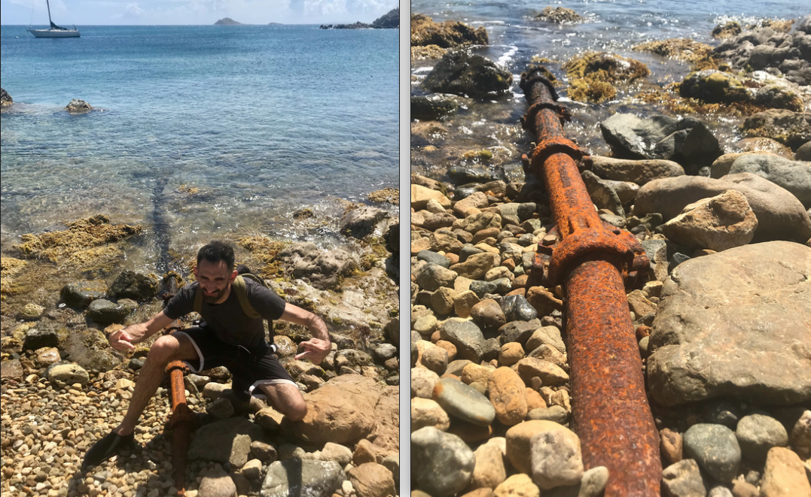
